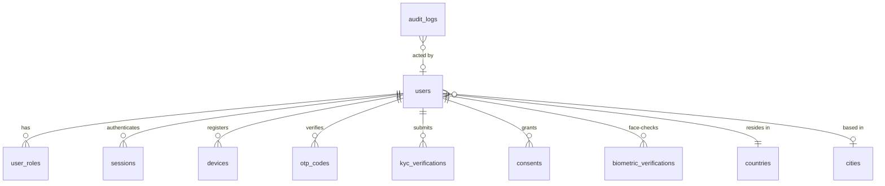
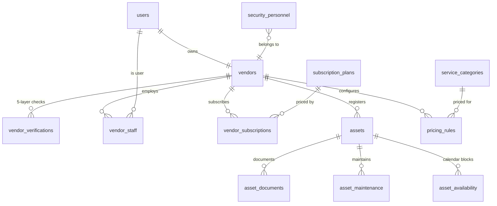
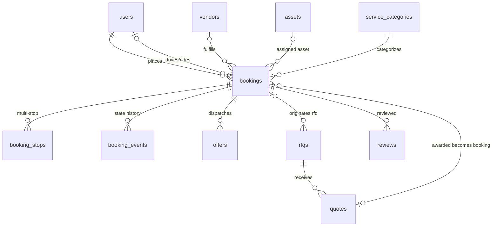
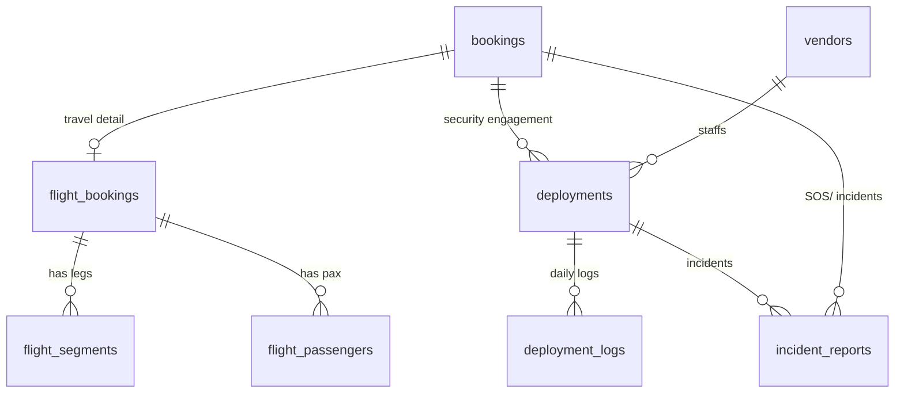
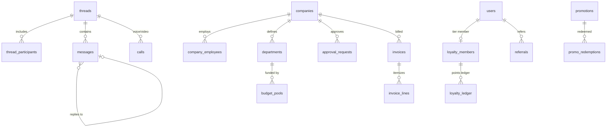
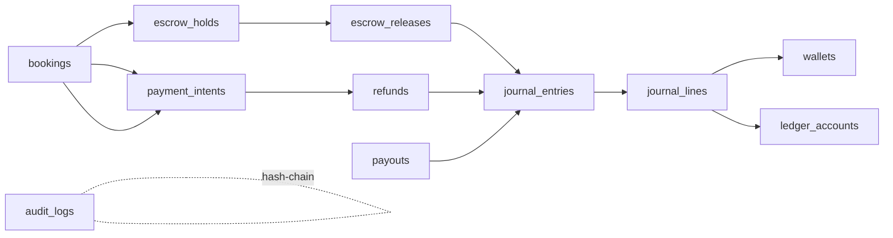

# 22 · ER Diagrams (Core Domains)

Full DDL: `database/schema.sql`. Diagrams below are Mermaid `erDiagram` views of the core clusters.

## 1. Identity & Access

## 2. Vendor & Assets

## 3. Booking, Matching & RFQ

## 4. Money, Wallet & Escrow

```mermaid
erDiagram
  users ||--o{ wallets : holds
  vendors ||--o{ wallets : holds
  companies ||--o{ wallets : holds
  wallets ||--o{ journal_lines : "movement lines"
  ledger_accounts ||--o{ journal_lines : "posts to"
  journal_entries ||--o{ journal_lines : contains
  bookings ||--o{ journal_entries : "money source"
  bookings ||--o{ payment_intents : pays
  payment_intents ||--o{ refunds : refunds
  users ||--o{ payment_methods : saves
  bookings ||--o| escrow_holds : "protected by"
  escrow_holds ||--o{ escrow_releases : "tranche releases"
  escrow_releases }o--|| journal_entries : "posts money"
  payouts }o--|| journal_entries : "posts money"
  vendors ||--o{ payouts : receives
  disputes }o--o| escrow_holds : freezes
  disputes ||--o{ dispute_messages : discusses
  rfqs ||--o{ quotes : "milestone plans"
```

## 5. Travel & Security Ops

## 6. Comms, Corporate & Growth

## 7. Booking ↔ Money Traceability (the audit spine)

Every naira is traceable: booking → payment intent → escrow hold → release → journal entry → balanced lines → wallet/ledger account — with an append-only audit log hash-chained alongside.
