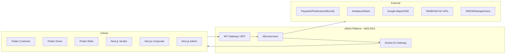
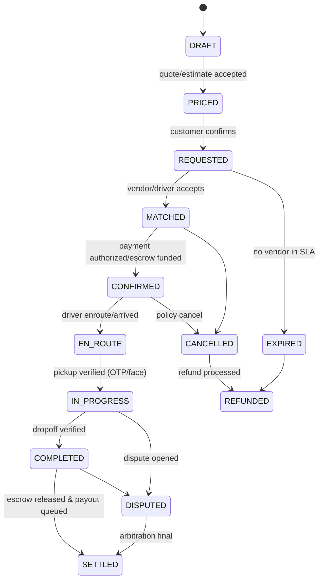

# 05 · Software Requirements Specification (SRS)

**Deliverables:** 8 (SRS) · 9 (Functional Requirements) · 10 (Non-Functional Requirements)
**Author:** Enterprise Solution Architect / QA Lead · **Version:** 1.0 · IEEE-830-aligned

---

## 1. System Overview & Context

AMSA is a cloud-native, event-driven microservices platform (NestJS/Node.js) with PostgreSQL, Redis, Kafka event backbone, Socket.IO realtime, S3 storage, on AWS EKS; clients are Flutter mobile apps and Next.js web portals. External systems: Paystack/Flutterwave/Monnify (payments), Amadeus/Sabre (travel), Google Maps/OSM (maps), WebRTC SFU + PSTN masking (comms), SMS/WhatsApp gateways, FCM, identity verification APIs (NIN/BVN/CAC/TIN).

## 2. Functional Requirements

Requirement IDs: `FR-<domain><nnn>`. Verification method: T = test, I = inspection, D = demonstration.

### 2.1 Identity & Access (AUTH)

| ID | Requirement | Priority | Verif. |
|---|---|---|---|
| AUTH-001 | System shall register users with phone + OTP; email verification where supplied | Must | T |
| AUTH-002 | System shall support password + OTP login, refresh-token rotation, and device session listing with remote revoke | Must | T |
| AUTH-003 | System shall enforce MFA (TOTP or SMS) for: admin roles, wallet withdrawals, payouts, vendor activation, corporate admin changes | Must | T |
| AUTH-004 | System shall implement RBAC with 13 role types and fine-grained permissions; deny by default | Must | T |
| AUTH-005 | System shall support OAuth 2.0 social login (Google, Apple) with account linking to phone identity | Should | T |
| AUTH-006 | System shall fingerprint devices (hardware + behavioral hash) and flag new-device money actions for step-up | Must | T |
| AUTH-007 | All authentication events shall be audit-logged (who/what/when/where/IP/device) | Must | I |

### 2.2 Vendor Management (VND)

| ID | Requirement | Priority | Verif. |
|---|---|---|---|
| VND-001 | System shall capture vendor registration: business identity, CAC number, TIN, address, licenses, insurance, bank account, beneficial owners | Must | T |
| VND-002 | System shall verify email, phone (OTP), identity (NIN/BVN), address, business (CAC lookup), tax (TIN), bank (penny-drop/name check), license, insurance | Must | T |
| VND-003 | System shall place vendors in PENDING_REVIEW and require named admin approval before activation; approvals MFA-confirmed | Must | T |
| VND-004 | Security providers shall additionally require license + insurance + compliance verification documents with expiry dates; auto-suspend on expiry | Must | T |
| VND-005 | System shall manage assets (car/motorcycle/aircraft/boat) with photos, videos, documents, pricing rules, availability calendar, maintenance records, insurance records, capacity | Must | T |
| VND-006 | System shall enforce subscription plan limits (listings, monthly bookings, commission tier, payout speed) | Must | T |
| VND-007 | System shall compute vendor scorecards: acceptance rate, completion rate, rating, SLA adherence, incident count | Must | T |

### 2.3 Booking Engine (BKG)

| ID | Requirement | Priority | Verif. |
|---|---|---|---|
| BKG-001 | System shall support instant, scheduled (≤30 days), corporate, recurring, and quote-based booking types | Must | T |
| BKG-002 | System shall enforce the booking state machine (see SRS §4) — illegal transitions rejected with 409 | Must | T |
| BKG-003 | Instant matching shall offer to nearest ranked vendor assets with 15s timeout and ≤5-deep cascade | Must | T |
| BKG-004 | Quote-based bookings shall broadcast RFQ to ≤ N qualifying vendors and return priced quotes with validity windows | Must | T |
| BKG-005 | System shall compute fares: base + distance + time + surge(cap 2.0×) + extras (stops/wait), and quote AI-predicted range pre-booking | Must | T |
| BKG-006 | Cancellation policy engine shall charge tiered fees by timing; NO-SHOW fees split 70/30 | Must | T |
| BKG-007 | Multi-stop deliveries shall be sequence-optimized by routing service with stop-level status + OTP release | Must | T |
| BKG-008 | Recurring bookings shall materialize child bookings per schedule (daily/weekly/monthly) with skip/pause controls | Should | T |
| BKG-009 | System shall support service coverage geofences per city/category and reject out-of-coverage requests with nearest-coverage guidance | Must | T |

### 2.4 Payments, Wallet, Escrow (PAY)

| ID | Requirement | Priority | Verif. |
|---|---|---|---|
| PAY-001 | System shall maintain five wallet types with double-entry ledger; no balance mutation without a balanced journal entry | Must | T |
| PAY-002 | System shall process card/bank funding via PSP failover chain Paystack→Flutterwave→Monnify with idempotent webhook reconciliation | Must | T |
| PAY-003 | Escrow: authorize/hold at booking confirm; capture on service completion; auto-split commission, VAT/WHT where applicable, vendor remainder | Must | T |
| PAY-004 | System shall support partial & full refunds with reason codes, policy checks, and reversal journal entries | Must | T |
| PAY-005 | Disputes shall have evidence, arbitration states, SLA timers (respond 24h, resolve 72h) | Must | T |
| PAY-006 | Payouts shall run as batch jobs (T+1 default; same-day for qualifying tiers) with PSP transfer APIs + reconciliation reports | Must | T |
| PAY-007 | Chargeback webhooks shall freeze related ledger entries and open dispute case | Must | T |
| PAY-008 | All monetary amounts stored as integer minor units + currency; FX rates versioned with effective timestamps | Must | I |
| PAY-009 | Rewards: accrual rules (1pt/₦100), cashback %, redemption ledger; expiry policies | Should | T |

### 2.5 Maps & Tracking (MAP)

| ID | Requirement | Priority | Verif. |
|---|---|---|---|
| MAP-001 | GPS location ingest from driver/rider apps ≤ every 5s active trip, ≤ 60s idle; store trajectory in TimescaleDB/Redis stream | Must | T |
| MAP-002 | ETA prediction p95 error ≤ 20% for ≤ 30-min horizons | Must | T |
| MAP-003 | Google Maps primary; automatic degradation to OSM routing/tiles on error/quota breach | Must | T |
| MAP-004 | Geofences: coverage areas, hotspots, no-go zones; eventing on enter/exit | Must | T |
| MAP-005 | Route deviation > 350m from route corridor for > 90s triggers safety alert | Must | T |
| MAP-006 | Heat maps of demand/supply for ops dashboards (15-min buckets) | Should | T |
| MAP-007 | Emergency location share: short-lived signed links + SMS with coordinates | Must | T |

### 2.6 Communication (COM)

| ID | Requirement | Priority | Verif. |
|---|---|---|---|
| COM-001 | In-app chat: text, image, voice note, PDF/doc, location; ≤ 25MB per attachment; E2E-encrypted at rest per-thread keys for chat content | Must | T |
| COM-002 | Read receipts + typing indicators via Socket.IO presence | Must | T |
| COM-003 | In-app voice calls via WebRTC with TURN; masked PSTN fallback via proxy numbers | Must | T |
| COM-004 | Video consultation rooms (travel/security/vendor) with scheduled slots | Should | T |
| COM-005 | Poor-quality detection (RTT/packet loss thresholds) → in-call banner offering masked call/SMS | Must | T |
| COM-006 | AI translation of chat messages (EN/Ha/Yo/Ig/Pidgin) opt-in per thread | Should | T |

### 2.7 Safety (SAF)

| ID | Requirement | Priority | Verif. |
|---|---|---|---|
| SAF-001 | SOS reachable ≤ 2 taps from any active service screen; opens incident with live location, trip context, and dials response line | Must | T |
| SAF-002 | Trusted contacts receive live-share on trip start (configurable: always/night-only) | Must | T |
| SAF-003 | Driver/rider face verification: daily activation selfie + random checks; mismatch locks dispatch | Must | T |
| SAF-004 | Anomaly detection: deviation, extended stops, panic patterns → tiered ops escalation ≤ 5 min | Must | T |
| SAF-005 | Incident timeline (locations, messages, calls) auto-captured and exportable to authorized parties only | Must | I |

### 2.8 Corporate (CORP)

CORP-001 company registration w/ documents & employee admin; CORP-002 departments & budget pools; CORP-003 threshold approval chains; CORP-004 policy rules (class caps, allowlists, curfews); CORP-005 monthly consolidated invoice + CSV/Excel export; CORP-006 spend analytics by dept/employee/category; CORP-007 booking-on-behalf by delegates. — All **Must** except CORP-006 analytics **Should**.

### 2.9 Admin & Analytics (ADM)

ADM-001 KYC/verification review queues with document viewer and MFA-approved decisions; ADM-002 user/vendor lifecycle management (suspend/ban/reactivate) with reason codes; ADM-003 promotions engine (promo codes, referral, campaigns) with budget caps; ADM-004 fraud console: alerts, device clusters, manual review actions; ADM-005 CMS: cities, categories, coverage, pricing parameters, feature flags; ADM-006 dashboards: revenue, bookings, per-vertical revenue, growth, driver/rider performance, corporate; ADM-007 immutable audit log search/export. — All **Must**.

### 2.10 AI Services (AI)

AI-001 fare prediction (range + confidence ±12% p50); AI-002 route optimization; AI-003 fraud scoring ≤ 150ms p95 inline; AI-004 dynamic pricing within guardrails + audit trail; AI-005 vendor matching composite score; AI-006 demand forecasting (MAPE ≤ 25% @ 1h horizon); AI-007 support assistant with human handoff (containment ≥ 50% by M12); AI-008 voice-to-text; AI-009 translation 5 languages; AI-010 call summaries. — AI-001..005 **Must**; 006..010 **Should**.

### 2.11 Notifications (NTF)

NTF-001 FCM push (Android/iOS) with fallback to SMS for critical events (SOS, OTP, trip reminders) — **Must**. NTF-002 templated multi-language notifications, quiet-hours rules, per-user channel preferences — **Must**. NTF-003 web (socket + browser push) for consoles — **Should**.

### 2.12 Internationalization & Multi-tenancy (I18N)

I18N-001 locale/currency/timezone per user & city; I18N-002 translations extensible without deploy (CMS-backed); I18N-003 multi-country config: tax rules (VAT/WHT), PSP sets, coverage, languages — **Must**. I18N-004 RTL-ready layouts — **Should**.

## 3. Data Requirements (summary)

Retention: bookings 7y (tax), ledger 10y, GPS trajectory 180d then aggregated, chat media 2y, KYC docs per NDPR minimization (5y relationship + limitation), audit logs 7y immutable. Full schema in `database/schema.sql`.

## 4. Booking State Machine (normative)

## 5. Non-Functional Requirements

| ID | Category | Requirement | Target |
|---|---|---|---|
| NFR-001 | Performance | API p95 latency (read) | ≤ 250 ms |
| NFR-002 | Performance | API p95 latency (write/booking) | ≤ 400 ms |
| NFR-003 | Performance | Match offer dispatch (taxi) p95 | ≤ 3 s |
| NFR-004 | Performance | Location ingest throughput | ≥ 5k events/s sustained |
| NFR-005 | Scalability | Horizontal autoscaling; stateless services; support 10× peak (city launch surge) without re-architecture | ≥ 25k concurrent sockets/svc |
| NFR-006 | Availability | Core booking & payments availability | 99.95% monthly |
| NFR-007 | Availability | Realtime (tracking/chat) availability | 99.9% |
| NFR-008 | Availability | Degraded mode: maps failover to OSM; chat falls back to SMS templates | automatic |
| NFR-009 | Durability | RPO ≤ 5 min (PITR), RTO ≤ 60 min (warm standby) | DR drill 2×/yr |
| NFR-010 | Security | TLS 1.2+ everywhere; AES-256 at rest; secrets in AWS Secrets Manager; annual pen test; dependency scanning in CI | gate |
| NFR-011 | Security | PCI DSS SAQ-A compliance; no PAN storage | audit |
| NFR-012 | Privacy | NDPR/GDPR: DSR (export/erase) ≤ 30d; consent ledger; data residency options | audit |
| NFR-013 | Observability | 100% request tracing (OpenTelemetry); log retention 90d hot / 1y cold | ops |
| NFR-014 | Maintainability | ≥ 80% unit coverage on domain modules; typed API contracts (OpenAPI); migrations forward-only | CI gate |
| NFR-015 | Usability | Crash-free sessions ≥ 99.7%; cold start ≤ 2.5s (mid-tier Android) | monitoring |
| NFR-016 | Accessibility | WCAG 2.1 AA for web consoles; mobile dynamic type + contrast | audit |
| NFR-017 | Portability | Multi-currency (8+), multi-timezone, multi-locale from day one | staging-proven |
| NFR-018 | Compliance | Immutable audit trail; reconciliation reports auto-generated daily | ops |
| NFR-019 | Resilience | Graceful PSP failover; retry with idempotency keys; circuit breakers on externals | chaos test |
| NFR-020 | Capacity | Year-1 design point: 500k users, 50k vendors, 1M bookings/mo, 10M GPS events/day | load test |

## 6. Traceability

Every FR maps to ≥ 1 test suite (`20-testing-qa.md` §Traceability matrix) and ≥ 1 BR in `03-brd.md`. Requirement IDs are referenced in commit messages (`FR-PAY-003`) and release checklists.
