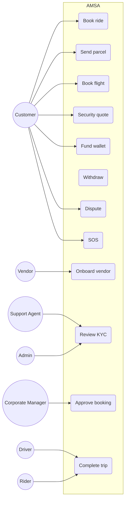

# 06 · User Stories & Use Cases

**Deliverables:** 11 (User Stories) · 12 (Use Cases) · **Version:** 1.0

---

## 1. User Stories

Format: *As a ⟨role⟩, I want ⟨capability⟩ so that ⟨benefit⟩.* AC = acceptance criteria anchor. Priorities: M = must, S = should, N = nice.

### Epic E1 — Customer Onboarding & Identity

| ID | Story | P | Key AC |
|---|---|---|---|
| US-101 | As a customer, I want to sign up with my phone number + OTP in < 60s so that I can book immediately | M | OTP ≤ 30s delivery; WhatsApp fallback; resend cooldown 60s |
| US-102 | As a customer, I want the app in my language (EN/Hausa/Yoruba/Igbo/Pidgin) so that I can use it confidently | M | Language switch live without restart |
| US-103 | As a diaspora user, I want to book & pay for a ride for my parent in Nigeria so that I can support family remotely | S | Payer ≠ rider supported; rider gets SMS with driver details |
| US-104 | As a customer, I want MFA on my wallet so my funds are safe | M | TOTP + SMS step-up for withdrawals/transfers |

### Epic E2 — Ride Booking

| ID | Story | P | Key AC |
|---|---|---|---|
| US-201 | As a customer, I want to pick a vehicle class with upfront fare range so I know cost before booking | M | Fare range ±12% p50; class ETA shown |
| US-202 | As a customer, I want my ride matched in under a minute so I'm not stranded | M | p95 match ≤ 60s Lagos |
| US-203 | As a customer, I want to schedule an airport pickup at 4am with a flight number so the driver waits | M | Reminder T-12h & T-30m; flight-aware wait |
| US-204 | As a customer, I want live tracking + shareable trip link so contacts follow my journey | M | Link expires at trip end +30m |
| US-205 | As a customer, I want to add ≤3 stops so I can run errands in one trip | S | Fare recalculated on stop add |
| US-206 | As a customer, I want corporate auto-billing when booking under my company so I don't pay out of pocket | M | Policy checks enforced pre-booking |

### Epic E3 — Logistics & Delivery

| ID | Story | P | Key AC |
|---|---|---|---|
| US-301 | As a sender, I want a dispatch rider within 90 minutes so I can move documents same-hour | M | SLA timer visible; cascade to 2nd vendor on timeout |
| US-302 | As a sender, I want recipient OTP release so the parcel only goes to the right person | M | 4–6 digit OTP; 3 attempts then ops hold |
| US-303 | As a business owner, I want multi-stop optimized routes so I cut delivery cost | S | ≥ 15% distance saving vs input order (avg) |
| US-304 | As a business owner, I want to upload a manifest CSV so 50 parcels book at once | S | Validation report; partial failure handling |

### Epic E4 — Travel

| ID | Story | P | Key AC |
|---|---|---|---|
| US-401 | As a traveller, I want to search & compare domestic flights so I book the best deal | M | Results ≤ 15s; price locked 10 min |
| US-402 | As a traveller, I want my agency payment escrowed until the e-ticket is issued so I'm not defrauded | M | Auto-release on ticket PNR; refund path if not issued in 24h |
| US-403 | As a traveller, I want multi-city itineraries so I plan business trips in one search | S | ≤ 6 legs |
| US-404 | As a traveller, I want the app to suggest an airport transfer after booking so I land with a ride | S | One-tap attach with fare |

### Epic E5 — Security Marketplace

| ID | Story | P | Key AC |
|---|---|---|---|
| US-501 | As an exec assistant, I want to request VIP escort quotes with a scope builder so I get professional proposals | M | ≤ 3 quotes in 2h; admin-screened vendors only |
| US-502 | As a security buyer, I want to see each provider's verified license/insurance so I can trust the team | M | Badges + expiry shown; expired → hidden |
| US-503 | As a corporate client, I want a monthly security retainer with milestone releases so payments match delivery | S | Milestone approval gates payout |

### Epic E6 — Wallet & Escrow

| ID | Story | P | Key AC |
|---|---|---|---|
| US-601 | As a customer, I want to fund my wallet by card or transfer so booking is one-tap | M | 3 PSPs; failover automatic |
| US-602 | As a customer, I want money held in escrow until service completes so vendors deliver | M | Escrow state visible on booking |
| US-603 | As a customer, I want a partial refund when a service under-delivers | M | Policy matrix + arbitration ≤ 72h |
| US-604 | As a vendor, I want same-day payout on Professional plan so cashflow works | M | Batch runs; payout report |
| US-605 | As a corporate finance lead, I want monthly consolidated invoices with VAT breakdown so I can reconcile | M | PDF + CSV; WHT field |

### Epic E7 — Driver & Rider

| ID | Story | P | Key AC |
|---|---|---|---|
| US-701 | As a driver, I want offers with fare, distance, and rider rating so I choose smartly | M | Offer card ≤ 15s response |
| US-702 | As a driver, I want daily earnings + instant cash-out so I manage money | M | Ledger-accurate; instant = fee 1.5% |
| US-703 | As a driver, I want face-verify activation so my account isn't stolen | M | Liveness; retry with support path |
| US-704 | As a rider, I want hotspot heat maps so I position for demand | S | 15-min demand grid |
| US-705 | As a driver, I want SOS too so I'm protected on trips | M | Same ≤ 2-tap protocol |

### Epic E8 — Vendor Console

| ID | Story | P | Key AC |
|---|---|---|---|
| US-801 | As a vendor, I want a dashboard of requests, fleet, drivers, and earnings so I run my business | M | Live queue; offline-safe |
| US-802 | As a fleet owner, I want asset profiles with docs & maintenance logs so I stay compliant | M | Expiry alerts T-30d |
| US-803 | As a vendor, I want pricing rules + availability calendar so I control my supply | M | Class pricing, surge participation toggle |
| US-804 | As a vendor, I want scorecard + improvement tips so I get more bookings | S | Weekly digest |

### Epic E9 — Corporate Portal

US-901 budgets per department with alerts at 80%; US-902 approval chains for bookings above thresholds; US-903 spend analytics by employee/category/city; US-904 policy rules (class caps, curfews, allowlists); US-905 delegate booking on behalf. — All M except US-903 S.

### Epic E10 — Trust, Safety & Support

US-1001 SOS with ≤ 2 taps and live ops response; US-1002 trusted contacts auto-share; US-1003 report flow with 72h SLA; US-1004 AI assistant that answers in my language and hands off with context; US-1005 dispute evidence upload. — All M.

---

## 2. Use Cases

### 2.1 Use Case Catalog (UC-xxx)

| ID | Name | Primary actor | Preconditions | Main outcome |
|---|---|---|---|---|
| UC-01 | Register & verify account | Customer | Phone available | Active L1 account |
| UC-02 | Complete KYC (L2) | Customer/D/iver/Rider | L1 account | Verified badge, higher limits |
| UC-03 | Book instant ride | Customer | Wallet funded / card | Matched driver, escrow held |
| UC-04 | Schedule airport transfer | Customer | L1+ | Scheduled booking confirmed |
| UC-05 | Send same-day parcel | Customer | Pickup in coverage | Rider assigned, POD captured |
| UC-06 | Book domestic flight | Customer | Wallet ≥ fare | Escrow → e-ticket issued |
| UC-07 | Request security escort quote | Corporate delegate | Corp account active | 3 quotes received, one accepted |
| UC-08 | Vendor onboarding & approval | Vendor | Business docs ready | Active vendor, assets listed |
| UC-09 | Asset registration | Vendor | Active vendor | Asset live in marketplace |
| UC-10 | Accept & complete trip | Driver | Online, face-verified | Earnings credited, escrow released |
| UC-11 | Multi-stop delivery run | Rider | Online in zone | All stops POD-verified |
| UC-12 | Fund wallet | Customer | Payment method | Balance credited, receipt |
| UC-13 | Withdraw earnings | Vendor/Driver/Rider | Balance ≥ min | Payout batch, bank credit |
| UC-14 | Open & resolve dispute | Customer | Completed booking | Refund/partial/deny decision |
| UC-15 | Trigger SOS | Customer/Driver | Active service | Ops response, incident timeline |
| UC-16 | Corporate approval flow | Manager | Approval request pending | Approved/rejected with audit |
| UC-17 | Admin KYC review | Support agent | Queue item | Approve/reject with reason |
| UC-18 | Run promotion | Admin | Campaign budget | Promo live with caps |
| UC-19 | Monitor fraud alert | Fraud analyst | Alert fired | Case dispositioned |
| UC-20 | Consultation video call | Customer↔Vendor | Booking context | Recording summary saved |

### 2.2 Detailed Use Case — UC-03 Book Instant Ride

| Field | Detail |
|---|---|
| Actors | Customer (primary), Driver/Vendor (supporting), Payment service, Matching engine |
| Preconditions | Customer L1+; pickup in coverage; payment method valid |
| Trigger | Customer taps **Confirm Ride** |

**Main flow**

1. Customer sets pickup (GPS/place) and destination, selects class.
2. System returns AI fare range + ETA and availability check.
3. Customer confirms; system creates booking `REQUESTED`, authorizes payment (wallet hold or card pre-auth).
4. Matching engine ranks candidates (distance, scorecard, class fit, capacity); offers to top candidate (15s timeout, 5-deep cascade).
5. Driver accepts → booking `MATCHED` → escrow `FUNDED` → booking `CONFIRMED`; customer notified with driver/asset profile.
6. Driver en route → `EN_ROUTE`; arrival; customer OTP/face pickup verify → `IN_PROGRESS`.
7. Live tracking active; deviation/anomaly monitors armed.
8. Dropoff → `COMPLETED`; fare finalized (extras: wait, stops); escrow split → commission/VAT/vendor; driver earnings credited.
9. Receipt + rating prompt; trip share link expires.

**Alternate flows**

- A1 No driver accepts → `EXPIRED` → auto-refund hold → suggest other class/schedule.
- A2 Customer cancels pre-match → free (grace 60s); post-match → policy fee.
- A3 Payment fails → booking held 5 min for payment retry.
- A4 SOS during trip → safety protocol (`07-process-flows.md` §6).

**Postconditions** Escrow settled; ledger entries balanced; vendor scorecard updated; trip archived.

### 2.3 Detailed Use Case — UC-14 Dispute & Arbitration

1. Customer opens dispute ≤ 48h after completion with category + evidence.
2. Funds move to `DISPUTE_HOLD`; both parties notified; vendor responds ≤ 24h.
3. Agent reviews evidence, chat log, GPS timeline, POD.
4. Outcomes: full refund / partial refund / release to vendor / chargeback pass-through — each writes reversal journals and audit entries.
5. Escalation to arbitration lead if contested; decision final; template notifications sent.

### 2.4 Use Case Diagram (core)

