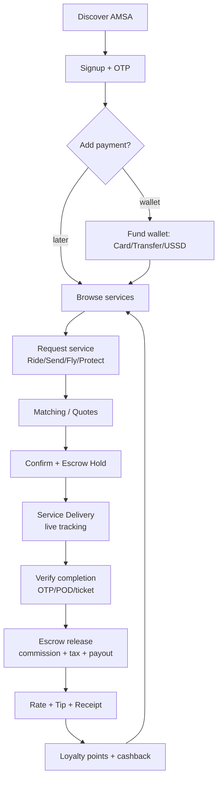
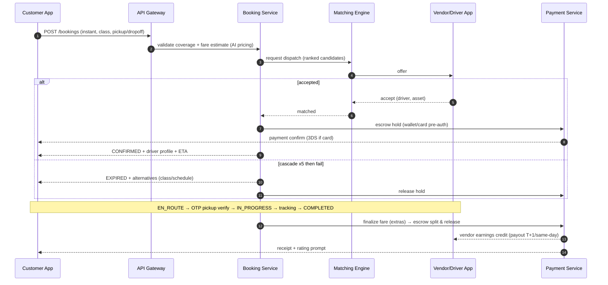
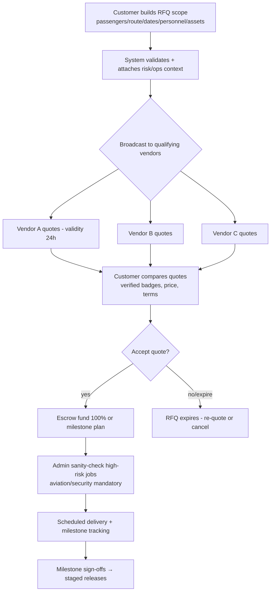
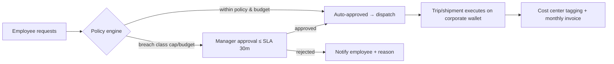
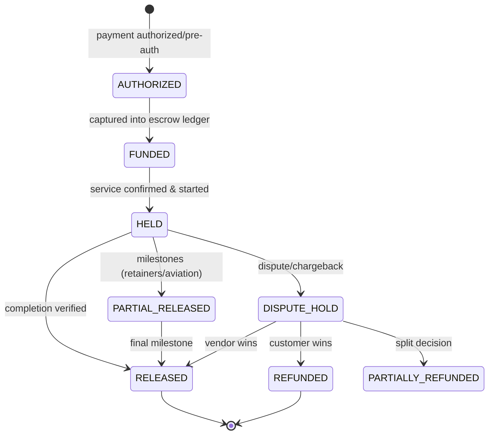
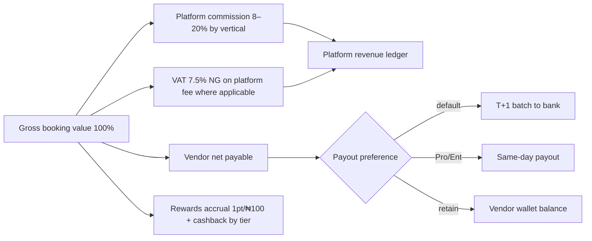
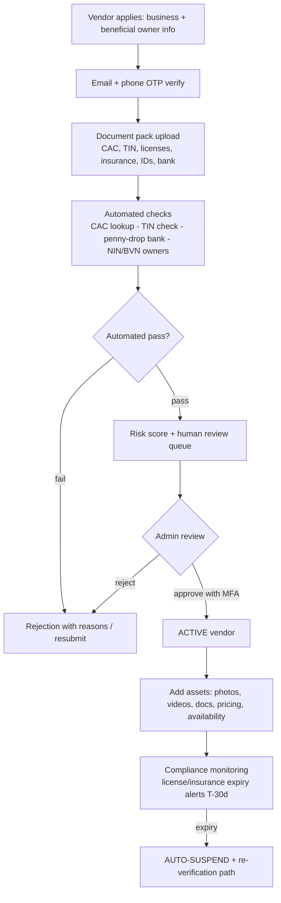
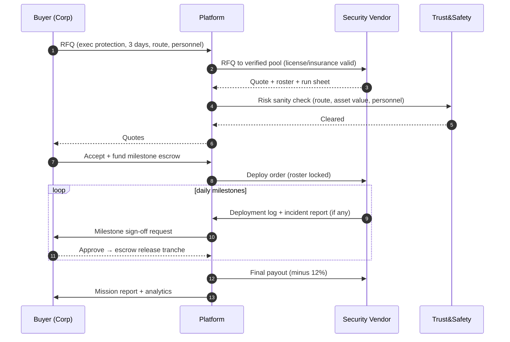
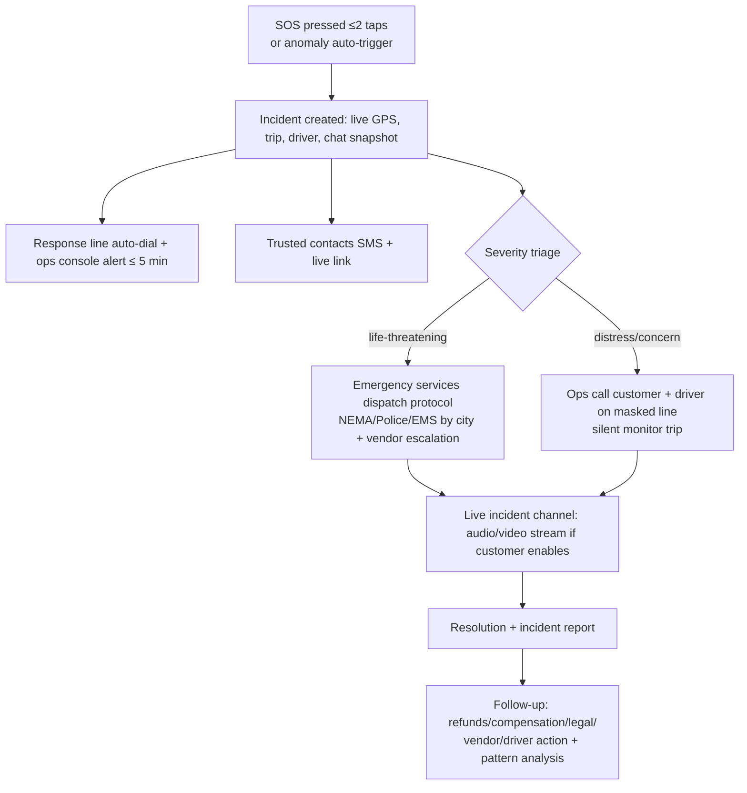
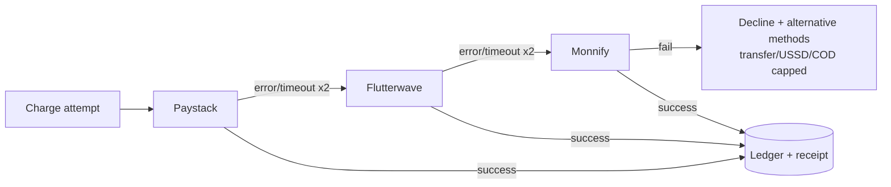

# 07 · Process Flows (Booking · Escrow · Security & Operations)

**Deliverables:** 13 (Process Flows) · 14 (Booking Workflows) · 15 (Escrow Workflows) · 16 (Security Workflows)

---

## 1. Master Customer Journey

## 2. Booking Workflows

### 2.1 Instant Booking (taxi, dispatch)

**Dispatch ranking score** = `0.35·proximity + 0.25·scorecard + 0.15·class/capacity fit + 0.10·acceptance momentum + 0.08·subscription tier + 0.07·fraud/health`.

### 2.2 Quote-Based Booking (aviation, security, event transport, luxury)

### 2.3 Scheduled & Recurring

- Scheduled: pre-assignment window T-2h; vendor SLA to confirm by T-1h else re-dispatch cascade + customer alert.
- Recurring (corporate): template materializes child bookings nightly; skips holidays via policy; exceptions route to approval chain.

### 2.4 Corporate Booking with Approvals

## 3. Escrow Workflows

### 3.1 Lifecycle

### 3.2 Settlement Split (per completed booking)

### 3.3 Money Movement Rules (normative)

| Rule | Detail |
|---|---|
| Double-entry | Every escrow/payout/refund = balanced journal (see `database/schema.sql` ledger tables) |
| Idempotency | All PSP webhooks & payout calls carry idempotency keys |
| Refund matrix | Vendor-fault: 100% + platform absorbs fee; customer-fault post-SLA: policy fee, remainder refunds; force-majeure: 100% |
| Partial refunds | Pro-rata milestones; VAT reversed proportionally |
| Chargeback | Freeze → evidence pack (GPS, chat, POD, signatures) → represent within 7d |
| Reconciliation | Hourly PSP webhook vs statement 3-way match; breaks page ops dashboard |
| Holds | New vendors: first 5 payouts manual review; fraud-scored accounts: rolling reserve ≤ 10% for 14d |

### 3.4 Dispute & Arbitration SLA

Open ≤ 48h post-completion → vendor responds 24h → agent decision 72h → arbitration final 7d. All state transitions emit events to audit + notify both parties.

## 4. Vendor Onboarding & Verification Workflow (all vendor types)

**Security providers (mandatory 5 layers):** Identity (all personnel IDs) + Business (CAC + years operating) + License (state/security authority permits) + Insurance (liability cover verified with insurer) + Compliance (background checks personnel, no-sanctions screening). Admin approval **required**; personnel roster locked per engagement.

## 5. Security Services Delivery Workflow (post-approval)

## 6. Safety / SOS Workflow

Anomaly triggers: route deviation >350m/90s, unscheduled stop >5min, panic shake gesture, device offline >10min mid-trip, mid-trip SOS keyword in chat.

## 7. Payment Failover Chain

## 8. City Launch Runbook (ops flow)

1. T-6wk: vendor pipeline (target: 120 cars, 60 bikes, 10 logistics cos, 5 travel agents, 3 security cos per city)
2. T-4wk: verification events (in-person doc days), coverage geofences, pricing study
3. T-2wk: driver/rider training + app install days; corporate pre-sales (10 accounts)
4. T-0: soft launch (invite codes) — liquidity checkpoints: match rate ≥ 80%, ETA p50 ≤ 8 min
5. T+2wk: public launch + performance marketing; heat-map-guided supply incentives
