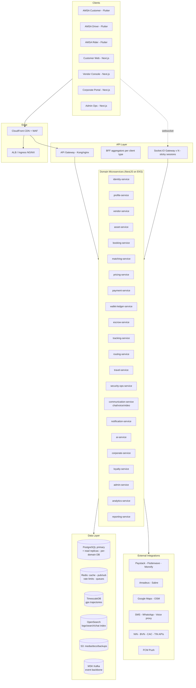

# 08 · System Architecture (Complete · Microservices · Event-Driven)

**Deliverables:** 17 (Complete System Architecture) · 18 (Microservices Architecture) · 19 (Event-Driven Architecture)

---

## 1. Guiding Principles

1. **Domain-driven microservices** — bounded contexts own their data (database-per-service, logical schemas in shared cluster at seed stage).
2. **Event-driven core** — state changes emit facts; consumers build views/projections (wallet balance caches, heatmaps, scorecards).
3. **API-first** — OpenAPI contracts generated from code; mobile/web are first-class API consumers.
4. **Progressive modularization** — start as a NestJS monorepo of independently deployable services sharing libs; split physically as load demands.
5. **Cloud-native** — 12-factor, stateless, K8s-deployed, GitOps CI/CD.
6. **Security zero-trust** — mTLS in-mesh, JWT + RBAC everywhere, no implicit trust.
7. **Failure-aware** — circuit breakers, PSP failover, map failover, SMS fallbacks.

## 2. Complete System Architecture



## 3. Microservices Catalog

| Service | Bounded context | Owns (data) | Key APIs | Emits |
|---|---|---|---|---|
| identity-service | AuthN/AuthM | users, sessions, roles, mfa, devices | login, otp, mfa, sessions | `user.registered`, `auth.mfa.enabled` |
| profile-service | Identity data | profiles, kyc_records, addresses, consent | kyc submit/status, dsrc | `kyc.submitted`, `kyc.verified` |
| vendor-service | Supply network | vendors, verifications, subscriptions, scorecards | onboarding, admin approval, plans | `vendor.activated`, `subscription.changed` |
| asset-service | Fleet registry | assets(cars/bikes/aircraft/boats), docs, maintenance, availability | CRUD, calendar, expiry monitor | `asset.available`, `doc.expiring` |
| booking-service | Orders | bookings, stops, quotes, rfqs | create/cancel/track, state machine | `booking.*` lifecycle |
| matching-service | Dispatch | offers, cascades | dispatch, accept/reject | `offer.sent`, `match.found` |
| pricing-service | Prices | fare_rules, surge_state, promos | estimate, finalize, promo validate | `price.quoted`, `surge.updated` |
| payment-service | PSP integrations | payment_intents, methods, webhooks | charge, refund, methods | `payment.*` |
| wallet-ledger-service | Money of record | wallets, ledger_accounts, journal_entries, payouts | balance, transfer, withdraw, statements | `ledger.posted`, `payout.executed` |
| escrow-service | Trust escrow | escrow_holds, releases, disputes | hold/release/refund/arbitrate | `escrow.*`, `dispute.*` |
| tracking-service | GPS | trips_location (Timescale), geofence events | ingest, position, history | `position.updated`, `geofence.entered` |
| routing-service | Routes | route_snapshots | eta, optimize, polyline | `eta.updated` |
| travel-service | Flights | flight_bookings, pnr, gds_logs | search/price/book (Amadeus→Sabre) | `travel.booked`, `eticket.issued` |
| security-ops-service | Protection ops | rfq scope, rosters, deployment logs, incidents | rfq, milestone, incident report | `security.milestone.approved` |
| communication-service | Comms | threads, messages, calls, masking numbers | chat, call signaling, translation | `message.sent`, `call.ended` |
| notification-service | Notify | templates, preferences, deliveries | send, prefs, FCM/SMS fanout | `notification.delivered` |
| ai-service | Intelligence | models registry, predictions, fraud cases, translations | predict fare, optimize, score fraud, forecast, assistant | `fraud.alert.raised` |
| corporate-service | Enterprise | companies, employees, departments, budgets, policies, approvals | org mgmt, approvals, billing | `corporate.approval.resolved` |
| loyalty-service | Retention | members, tiers, points, cashback, rewards | accrue, redeem, tier engine | `loyalty.tier.changed` |
| admin-service | Back office | audit_logs, cms, feature_flags, reviews | queues, admin actions, flags | `admin.action.logged` |
| analytics-service | BI | marts, rollups | dashboards, KPIs, exports | — |
| reporting-service | Reports | statements, invoices, tax reports | generate PDF/CSV, schedules | `report.ready` |

### Communication style per interaction

| Interaction | Style | Why |
|---|---|---|
| App → domain reads/writes | REST/HTTP + JWT | Simple, cacheable, traceable |
| Live tracking, chat, offers | Socket.IO (WebSocket) | Bidirectional, low-latency, fallback polling |
| Cross-service state facts | Kafka events | Durable replay, decoupled consumers |
| Cache invalidation / presence | Redis pub/sub | Ephemeral, fast |
| Long jobs (payouts, reports, recons) | BullMQ (Redis) workers | Retryable, scheduled, rate-limited |

## 4. Event-Driven Architecture

### 4.1 Topology

```mermaid
flowchart LR
  subgraph Producers
    BKG2[booking] ; PAY2[payment/escrow] ; TRK2[tracking] ; VND2[vendor] ; COM2[communication]
  end
  subgraph KFK2[Kafka topics - partitioned by bookingId/userId]
    T1[booking.events] 
    T2[money.events]
    T3[telemetry.events]
    T4[supply.events]
    T5[engagement.events]
    T6[fraud.events]
  end
  subgraph Consumers
    AN[analytics marts] ; NTF2[notifications] ; AI2[fraud/demand models] ; LOY2[loyalty accrual] ; WS2[socket fanout] ; AUD[audit sink → S3]
  end
  Producers --> KFK2 --> Consumers
```



### 4.2 Canonical Event Envelope

```json
{
  "event_id": "evt_01J8...",
  "event_type": "booking.completed",
  "event_version": 2,
  "occurred_at": "2026-08-31T10:14:22Z",
  "producer": "booking-service",
  "partition_key": "bkg_01J8...",
  "trace_id": "w7c... ",
  "actor": { "type": "customer", "id": "usr_..." },
  "data": { /* versioned payload */ },
  "schema_url": "https://schemas.amsa.africa/booking.completed.v2.json"
}
```

Rules: events are **facts** (past tense, immutable); consumers are idempotent (event_id dedupe); schema registry with backward-compatible evolution; DLQ per consumer group + replay tooling; every money event dual-written to audit sink.

### 4.3 Topic Catalog (seed set)

| Topic | Key events | Key consumers |
|---|---|---|
| `booking.events` | requested, matched, confirmed, en_route, in_progress, completed, cancelled, expired, disputed | notifications, analytics, loyalty, socket fanout |
| `money.events` | payment.succeeded, escrow.held/released/refunded, ledger.posted, payout.executed, chargeback.opened | analytics, reporting, fraud, escrow |
| `telemetry.events` | position.updated, geofence.entered/exited, deviation.detected | tracking views, safety, demand model |
| `supply.events` | vendor.activated, asset.available, offer.accepted/rejected, driver.online/offline | matching, heatmaps, analytics |
| `engagement.events` | message.sent, call.ended, notification.delivered, chat.translated | analytics, AI summaries |
| `fraud.events` | risk.scored, alert.raised, case.updated | admin fraud console, payment step-up |
| `platform.events` | feature_flag.changed, cms.published, city.launched | all services |

### 4.4 Sagas (distributed transactions)

**Trip fulfillment saga** (choreography): `booking.requested` → matching offers → `match.found` → payment auth → `escrow.held` → `booking.confirmed` → … → `booking.completed` → escrow split → `payout.executed`. **Compensations:** no-match → release auth; payment fail → cancel; dispute → `dispute_hold` reversal chain. Money states are safeguarded by the ledger (no negative balances; every saga step posts balanced journals), making compensation accounting-safe rather than hopeful.

## 5. Realtime Architecture (Socket.IO)

- Gateway pods (stateless) behind sticky sessions (ALB cookie); Redis adapter for cross-pod fanout.
- Rooms: `user:{id}`, `booking:{id}`, `vendor:{id}`, `city:{code}`, `ops:incidents`.
- Event contract (client→server): `location:update`, `chat:send`, `call:signal`, `presence:ping`. (server→client): `offer:new`, `booking:state`, `chat:message`, `driver:position`, `sos:alert`.
- Fallbacks: long-polling, then push-notification wake, then SMS for SOS/OTP.

## 6. Cross-Cutting Concerns

| Concern | Solution |
|---|---|
| AuthZ | JWT (15-min access / 30-day rotating refresh), RBAC scopes in gateway + service guards |
| Idempotency | `Idempotency-Key` header on all POST money/booking routes; 24h cache |
| Rate limiting | Redis token buckets per user/IP/route class (e.g., OTP: 5/h) |
| Tracing | OpenTelemetry → Jaeger/Tempo; trace_id propagates into Kafka headers |
| Feature flags | per-city/per-user toggles (verticals, aviation Phase-2 gating) |
| Multi-tenancy | `country_code`, `city_code`, `currency` on all domain rows; config-service tax/PSP maps |
| Timezones | store UTC; render in user tz; scheduling in user tz with UTC materialization |
