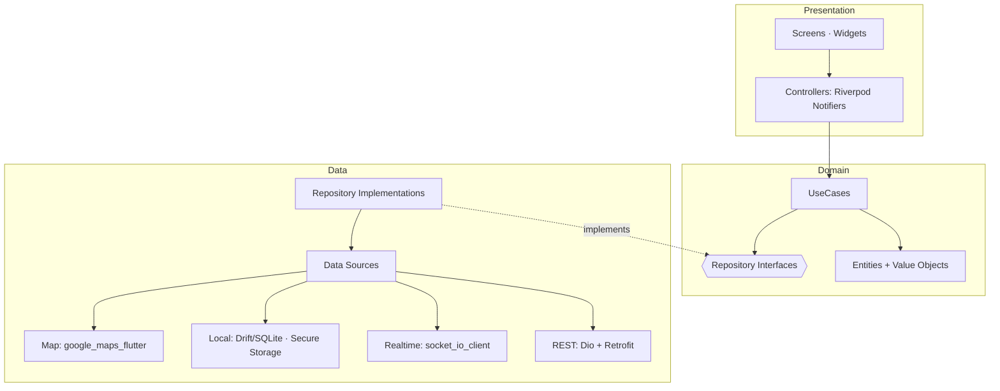

# 11 · Flutter Mobile Architecture (Customer · Driver · Rider)

**Deliverable:** 25 · **Baseline:** Flutter 3.24+ / Dart 3.5 · single codebase, 3 app flavors

---

## 1. Strategy

One Flutter codebase → **three apps** via flavors + entry points:

| App | Flavor | Target users | Differences |
|---|---|---|---|
| AMSA Customer | `customer` | riders/shippers/travellers | full consumer UX |
| AMSA Driver | `driver` | drivers | dispatch console, earnings |
| AMSA Rider | `rider` | dispatch riders | delivery console, POD |

Shared `core/` + `packages/`; feature folders compiled per flavor via conditional imports + flavor-gated routes. Keeps bundles small (~35MB target) and teams decoupled.

## 2. Architecture — Feature-First Clean Architecture



**State management:** Riverpod 2 (codegen) — `Notifier`/`AsyncNotifier` per feature; `AsyncValue` for loading/error states; no global mutable singletons.
**DI:** Riverpod providers = DI graph; overrides in `main_<flavor>.dart` for mocks.
**Navigation:** go_router with typed routes + deep links (`amsa://booking/bkg_123`, universal links) + role guards.

## 3. Folder Structure

```
mobile/
├── lib/
│   ├── main.dart                    # flavor bootstrap
│   ├── bootstrap/                   # env config, firebase, sentry, cache warmup
│   ├── app.dart                     # MaterialApp.router + theme
│   ├── core/
│   │   ├── config/                  # EnvConfig (flavor, api urls, feature flags)
│   │   ├── network/                 # Dio client, interceptors (auth, retry, idempotency), api_exception
│   │   ├── realtime/                # SocketService, presence, reconnect backoff
│   │   ├── storage/                 # drift db, secure_storage (tokens), kv cache
│   │   ├── location/                # location service, geofence monitor, battery-aware batching
│   │   ├── maps/                    # google + osm adapters (MapProvider interface)
│   │   ├── auth/                    # session controller, MFA flow, token refresh mutex
│   │   ├── safety/                  # SOS manager, shake detection, anomaly hooks
│   │   ├── i18n/                    # arb files: en, ha, yo, ig, pcm
│   │   ├── theme/                   # design tokens from docs/15
│   │   └── utils/                   # money, formatters, validators, result types
│   ├── features/
│   │   ├── auth/                    # onboarding, otp, login, mfa
│   │   ├── home/                    # service launcher
│   │   ├── ride/                    # (data) (domain) (presentation)
│   │   ├── logistics/
│   │   ├── travel/
│   │   ├── security_services/
│   │   ├── aviation/
│   │   ├── booking_common/          # tracking screen, state timeline, receipts, dispute
│   │   ├── wallet/                  # balance, fund, withdraw, statements
│   │   ├── chat/                    # threads, voice notes, attachments, calls
│   │   ├── safety/                  # SOS, trusted contacts, trip share
│   │   ├── loyalty/
│   │   ├── driver_console/          # driver flavor: offers, trip flow, earnings
│   │   ├── rider_console/           # rider flavor: delivery run, POD, hotspots
│   │   └── account/
│   └── l10n/
├── flavors/  customer/ driver/ rider/   # main entry, icons, splash, config
├── assets/   images/ icons/ maps/ lottie/
└── test/     unit/ widget/ integration/ (patrol)
```

## 4. Cross-Cutting Implementation Notes

| Concern | Approach |
|---|---|
| **Auth** | Access token 15 min in `flutter_secure_storage`; refresh mutex prevents stampede; 401 → refresh queue → re-login |
| **Offline-first** | Drift SQLite mirrors: active bookings, saved places, threads (last 50), wallet balance; optimistic state badges; queued actions (POD photos, positions) flush on reconnect |
| **Low bandwidth** | Image CDN `?w=` sized; map style lite on 2G (OSM raster fallback); voice note 16kbps Opus; socket compression |
| **Location** | Foreground service (Android) / background location (iOS when-in-use + always for drivers); adaptive ping: active trip 4s, enroute 10s, idle 60s; batch upload every 15s |
| **Realtime** | socket_io_client with exponential backoff; app-lifecycle aware disconnect; `offer:new` handled via background message + foreground stream |
| **Push** | FCM topics per city/role + device token; data messages drive offer screens; critical (SOS/OTP) = `priority=high` + SMS fallback |
| **Maps** | `MapProvider` interface with `GoogleMapsAdapter` and `OsmAdapter` (flutter_map); runtime switch on quota/error; polyline via encoded routes |
| **Payments UI** | No card PAN ever touched — PSP-hosted checkout (Paystack inline/Payment Pages; Flutterwave/Monnify same pattern); wallet UX native |
| **i18n** | ARB files × 5 languages; pseudo-locale test; RTL-ready layouts |
| **Theming** | Token file generated from design system (docs/15) — light/dark |
| **Safety** | Global `SosOverlay` reachable from root navigator; shake-to-SOS (opt-in); foreground trip monitoring |

## 5. Key Code Contracts (samples)

```dart
// domain/repositories/booking_repository.dart
abstract class BookingRepository {
  Future<Result<BookingEstimate>> estimate(EstimateRequest r);
  Future<Result<Booking>> create(CreateBookingRequest r);   // idempotency key auto
  Stream<BookingState> watchState(String bookingId);        // socket + rest fallback
  Future<Result<void>> cancel(String id, CancelReason r);
}

// presentation — ride booking controller (excerpt)
@riverpod
class RideBookingController extends _$RideBookingController {
  @override
  FutureOr<RideBookingState> build() => const RideBookingState.initial();

  Future<void> confirm(RideDraft draft) async {
    final est = await ref.read(bookingRepoProvider).estimate(draft.toEstimate());
    state = AsyncData(RideBookingState.priced(draft: draft, estimate: est));
  }

  Future<void> book() async {
    final s = state.value!;
    state = const AsyncLoading();
    state = await AsyncValue.guard(() async {
      final b = await ref.read(bookingRepoProvider).create(s.toCreate());
      ref.read(realtimeProvider).joinRoom('booking:${b.id}');
      return s.copyWith(booking: b, phase: Phase.tracking);
    });
  }
}
```

## 6. Build & Release

- CI (`mobile` workflow): analyze → unit → golden → widget → Patrol integration (device farm) → build apk/ipa (flavor matrix) → Firebase App Distribution → store rollout (staged 10→50→100%).
- Versioning: semver + build number per flavor; forced-upgrade endpoint gate (`min_versions`).
- Crash & performance: Sentry + Firebase Performance; crash-free target ≥ 99.7%.
