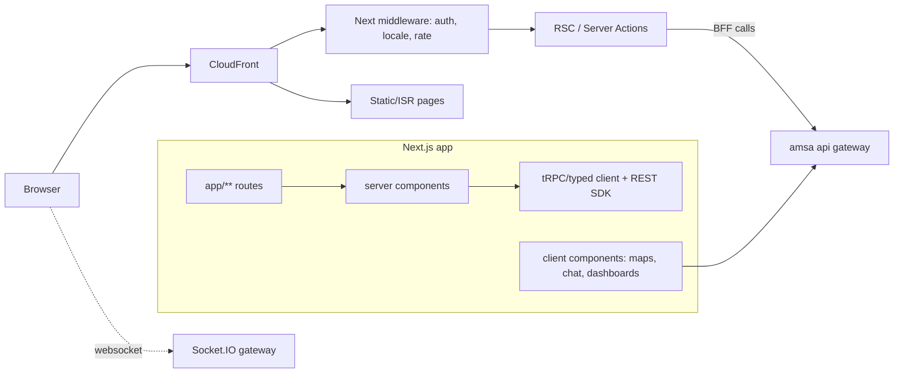

# 12 · Next.js Web Architecture

**Deliverable:** 26 · **Baseline:** Next.js 15 (App Router) · TypeScript · Tailwind CSS

---

## 1. Portals on One Codebase

| Route space | Portal | Auth | Render strategy |
|---|---|---|---|
| `/` `/ride` `/send` `/fly` `/protect` | Marketing + customer web (book, track, wallet) | Customer JWT | ISR marketing / client-heavy app flows |
| `/vendor/*` | Vendor Console (all 15 vendor types) | Vendor JWT + MFA | SPA-like client + server actions |
| `/corporate/*` | Corporate Portal | Corp SSO/JWT + MFA | Server components + RSC forms |
| `/admin/*` | Admin Control Center | Admin JWT + MFA + IP allowlist | RSC + server actions, audit-bar |
| `/ops/*` | Support/T&S console (incident room) | Agent JWT | Realtime (socket) client |

Route groups isolate layouts, middleware guards, and bundles: `(marketing)`, `(customer)`, `vendor`, `corporate`, `admin`, `ops`.

## 2. Architecture



**Data layer:** generated TypeScript SDK from OpenAPI (`api/` contract-first); server components call services directly with service-to-service tokens; client mutations via server actions (progressive enhancement) or typed fetchers.

**Auth:** short-lived access cookie (httpOnly, 15 min) + rotating refresh; MFA challenge page for money/admin actions; device fingerprint header for risk engine.

**Realtime:** `socket.io-client` in client components (tracking maps, chat, ops incident room) with auth handshake token.

**i18n:** `[locale]` segment (`/en`, `/pcm`, `/ha`…) middleware negotiation; messages via CMS-backed JSON.

## 3. Folder Structure

```
web/
├── app/
│   ├── (marketing)/[locale]/          page.tsx, ride/, send/, fly/, protect/, pricing/, legal/
│   ├── (customer)/[locale]/app/       home, bookings/[id], wallet, chat, loyalty, safety, account
│   ├── vendor/                        dashboard, requests, fleet/assets, staff, pricing,
│   │                                  availability, earnings/payouts, subscription, quotes/rfqs,
│   │                                  reviews, security-ops(rosters, deployments, incidents)
│   ├── corporate/                     overview, employees, departments, budgets, approvals,
│   │                                  bookings, invoices, analytics
│   ├── admin/                         queues(kyc,vendors,disputes), users, vendors, bookings,
│   │                                  escrow/payouts, promotions, fraud, cms, flags,
│   │                                  analytics, audit-logs, incidents
│   ├── api/                           route handlers: webhooks ( PSP), og-images, health
│   ├── layout.tsx · middleware.ts · error.tsx · not-found.tsx
├── components/
│   ├── ui/                            # design-system primitives (Button, Card, Input, Sheet, Toast…)
│   ├── booking/                       # map tracking, state timeline, fare card, stops editor
│   ├── chat/                          # thread list, composer, voice recorder, call bar
│   ├── dashboard/                     # stat cards, charts (recharts), data tables (tanstack)
│   └── safety/                        # sos button, share dialog
├── lib/                               # api client sdk, auth session, money, geo, rbac helpers
├── hooks/ · stores/ · styles/ · messages/[locale].json
└── tests/                             # vitest + playwright
```

## 4. Key Screens (web)

- **Customer tracking page:** live map (Google JS API w/ OSM fallback), driver card, state timeline, chat drawer, SOS rail, escrow badge.
- **Vendor dashboard:** request queue (realtime), fleet table (asset docs/expiry chips), earnings & payout schedule, scorecard, subscription plan manager.
- **Corporate analytics:** spend by dept/category/city (charts), budget burn bars, approval inbox, invoice PDF viewer.
- **Admin:** verification queue with document viewer + MFA-confirmed decision bar; escrow ledger explorer; fraud case console with device clusters; audit log viewer with hash-chain verification.

## 5. Performance & Quality Gates

| Concern | Standard |
|---|---|
| Rendering | Marketing ISR (revalidate 300s); portals client-heavy but RSC-first for data tables |
| Bundle | route-level code-split; maps & charts lazy; LCP < 2.5s on 3G-fast |
| Accessibility | WCAG 2.1 AA; keyboard nav; focus management in dialogs |
| SEO | metadata API, sitemap, OG image generation (`/api/og`) |
| Security | CSP headers, strict-origin cookies, CSRF double-submit on server actions, dependency scanning |
| Testing | Vitest unit, Testing Library, Playwright E2E per portal; visual regression on design-system docs |
| Deploy | Containerized on EKS behind same CDN/WAF; preview environments per PR |
