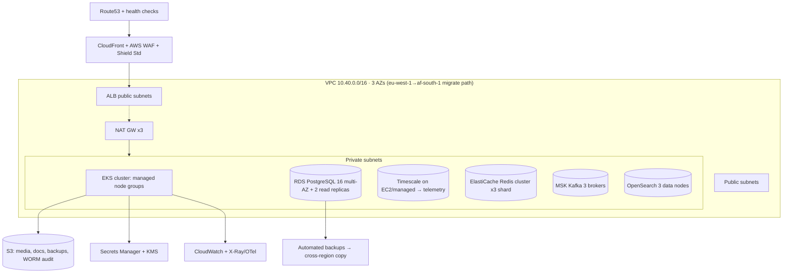
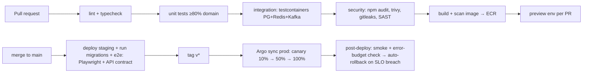

# 16 · AWS Infrastructure · Kubernetes · CI/CD

**Deliverables:** 38 (AWS Infrastructure) · 39 (Kubernetes) · 40 (CI/CD) · IaC: `infra/`

---

## 38 · AWS Infrastructure Design

| Concern | Choice | Notes |
|---|---|---|
| Region | `af-south-1` (Cape Town) primary | Lowest latency to Nigeria among AWS Africa regions; revisit when `NG` region GA |
| Compute | EKS 1.30, Graviton (m7g/c7g) | ~20% cost saving |
| DB | RDS PostgreSQL 16 db.r6g.xlarge multi-AZ ×2 RR | PgBouncer sidecar; logical schemas per domain |
| Cache/queues | ElastiCache Redis 7 (cluster mode) | session, rate-limit, BullMQ, socket adapter |
| Events | MSK Kafka (or self-managed on EKS at seed to save) | 3 brokers, 30-day retention money topics |
| Storage | S3 + CloudFront | media/docs signed URLs; object-lock (WORM) for audit archive |
| Identity | IAM roles for SA (IRSA) — no static keys | |
| Secrets | Secrets Manager + KMS CMKs | rotation Lambdas for PSP/GDS keys |
| Edge security | WAF managed rules + rate rules + bot control | |
| Cost guardrails | Budgets, Spot for stateless nodes, Savings Plan for DB | ~$4.1–5.5k/mo at seed scale (see `23-costs-financials.md`) |

## 39 · Kubernetes Architecture

**Namespaces:** `gateway`, `core` (booking/matching/pricing), `money` (payment/wallet/escrow — restricted PSP), `comms`, `ai`, `ops` (admin/reporting), `data-jobs` (CronJobs: payouts, reconciliation, rollups), `ingress`, `observability`.

**Workload standards**

| Item | Standard |
|---|---|
| Deployments | 2+ replicas (money: 3), PDB minAvailable 1, topology spread across AZs |
| Autoscaling | HPA (CPU 65% + custom RPS/socket-metrics); Kafka consumers on lag |
| Resources | requests=limits for money (Guaranteed QoS); others requests-only |
| Probes | /healthz liveness, /readyz readiness (checks deps), startup for JVM-free Nest = fast |
| Config | ConfigMap (non-secret) + Secrets Manager CSI; env-from |
| Ingress | NGINX ingress + cert-manager (ACME) or ACM at ALB; per-portal hosts |
| Service mesh | Linkerd (mTLS, retries, circuit breaking) — lighter than Istio |
| Jobs | CronJobs with leader-election lease: payout-batch 06:30/14:30, reconcile hourly, rollups 15-min |
| Node groups | `stateless` (Spot), `money` (On-Demand isolated), `ml` (GPU on-demand for batch scoring) |

**Sample deployment** and full manifests/Helm: `infra/k8s/` (namespace, deployment, hpa, ingress, network policies denying money→internet egress).

## 40 · CI/CD Pipeline

Stack: **GitHub Actions → ECR → Argo CD (GitOps)**. Environments: `dev` (auto-deploy) → `staging` (auto + migrations) → `prod` (manual approval + canary).

**Mobile pipeline (GitHub Actions → Fastlane):** analyze/test → build flavors (customer/driver/rider) → Firebase App Distribution → TestFlight/Play internal → staged production rollout (10→50→100) with halt-on-crash metrics.

**Quality gates:** unit coverage ≥ 80% (domain libs), contract tests (Pact) on API changes, migration dry-run against prod snapshot, SBOM (CycloneDX) per image, sign images (Cosign).

**GitOps layout:** `infra/gitops/{env}/{app}` — Argo watches; PRs to `infra` = deploy PRs with review + automated diff render.
