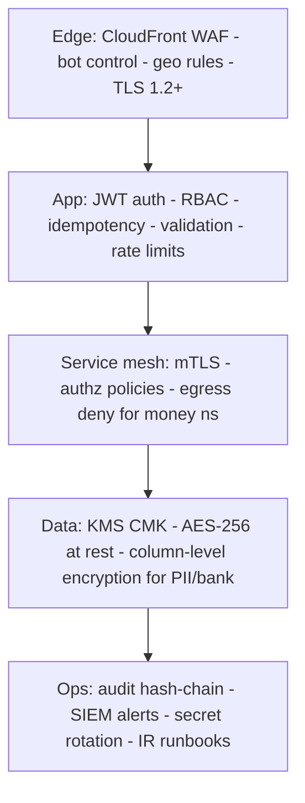

# 17 · Security Architecture

**Deliverable:** 41 · **Standards:** NDPR · GDPR · PCI DSS (SAQ-A target) · ISO 27001-aligned controls · NIST CSF

---

## 1. Defense-in-Depth Layers

## 2. Identity, Access & RBAC

- **AuthN:** phone OTP + password optional; JWT access (15 min) + rotating refresh (30 d) with reuse-detection; WebAuthn passkeys Phase 2.
- **MFA (mandatory):** admin/super-admin, vendor activation, payouts, withdrawals, corporate role changes, dispute resolution. TOTP primary, SMS fallback.
- **RBAC matrix (excerpt)** — deny by default; permissions granted per scope (`own`, `vendor`, `company`, `city`, `global`):

| Capability | Customer | Driver/Rider | Vendor | Corp Admin | Support | Admin | Super Admin |
|---|---|---|---|---|---|---|---|
| Create booking | ✓ own | ✓ self | ✓ | ✓ company | ✓ on-behalf | ✓ | ✓ |
| Release escrow | — | — | — | — | — | ✓ (MFA) | ✓ |
| Approve vendor | — | — | — | — | review only | ✓ (MFA) | ✓ |
| Resolve dispute | — | — | — | — | propose | ✓ (MFA) | ✓ |
| Refund > ₦500k | — | — | — | — | — | ✓ | ✓ (MFA) |
| Manage admins | — | — | — | — | — | — | ✓ (MFA + 4-eyes) |
| View audit logs | — | — | — | — | read | read | read+verify |

- **Just-in-time admin access:** time-boxed elevation with reason, auto-revoke, full session recording of admin console actions.
- **Customer trust features:** number masking (proxy numbers), optional direct-number sharing, per-thread chat keys.

## 3. Data Protection

| Data | Protection |
|---|---|
| Card data | **Never touches AMSA systems** — PSP-hosted checkout only (PCI SAQ-A); tokens only |
| Bank accounts, NIN/BVN refs, IDs | KMS envelope column encryption; masked in UI/logs |
| Chat content | per-thread data keys; TLS in transit; encrypted at rest; media via signed URLs (15 min) |
| GPS | access-controlled; 180-day raw retention |
| Audit logs | append-only + hash-chain + S3 Object Lock (WORM) |
| Backups | encrypted CMK; cross-region; quarterly restore tests |

**Privacy (NDPR/GDPR):** consent ledger with policy versions · DSR endpoints (export/erasure ≤ 30 days; ledger-preserving anonymization) · DPIA for AI + biometrics · data residency mapping (Phase 3: EU/US corridors) · sub-processor register · breach notification runbook (NDPC ≤ 72h).

## 4. Fraud & AML

- **Signals:** device fingerprint clusters, IP/VPN, velocity (wallet top-ups, OTP requests), account age, GPS spoofing detection, collusion graphs (customer↔driver same device/WiFi).
- **Rules + ML:** real-time risk score (≤150 ms) on register/login/pay/withdraw → thresholds: low (pass) / medium (step-up MFA) / high (manual review) / block.
- **AML:** transaction monitoring thresholds, SAR-ready reporting pack, sanctions screening at vendor onboarding (name screening list), structured payouts only to verified bank accounts (name match).
- **Vendor fraud controls:** first-5-payout manual review, rolling reserve ≤10%/14d for high-risk, GPS-trip completion cross-check before release, collusion network analysis.

## 5. Application Security Engineering

| Control | Implementation |
|---|---|
| SDL | threat model (STRIDE) per epic; security review gate for money/auth changes |
| Input validation | class-validator DTOs server-side; allow-lists; no raw SQL (ORM + parameterized) |
| Rate limiting | per-user/IP/route (OTP 5/h; login 10/h; charge 20/h) |
| Secrets | Secrets Manager + rotation; gitleaks in CI; no secrets in images/env-commits |
| Dependencies | lockfiles, Dependabot, `npm audit`/Trivy gates on highs |
| Headers | CSP, HSTS, X-Content-Type-Options, frame-ancestors none |
| WebRTC | DTLS-SRTP, TURN auth time-boxed |
| Testing | SAST (CodeQL), DAST (ZAP) nightly on staging, annual third-party pen test, bug bounty (Phase 2) |

## 6. STRIDE Threat Model (top risks & mitigations)

| Threat | Vector | Mitigation |
|---|---|---|
| Spoofing | stolen driver account | face verification daily, device binding, step-up |
| Tampering | webhook forgery | PSP signature verify, replay dedupe, idempotency |
| Repudiation | payout disputes | hash-chained audit + signed webhooks + statements |
| Info disclosure | PII leakage via logs | PII redaction middleware, masked fields, log scanners |
| DoS | booking/OTP floods | WAF rate rules, queues, OTP spend caps |
| Elevation | admin takeover | MFA + 4-eyes + JIT + IP allowlist on /admin |
| Supply chain | malicious package | lockfiles, provenance, SBOM, Cosign signing |

## 7. Incident Response

Severity ladder S1–S4 · 24/7 on-call (ops + engineer) · S1 (money/safety/data): 15-min ack, war room, comms template, NDPC/GDPR breach clock, post-mortem blameless within 5 days. Runbooks: `sos-incident`, `psp-outage`, `fraud-ring`, `data-exposure`, `db-failover`.
