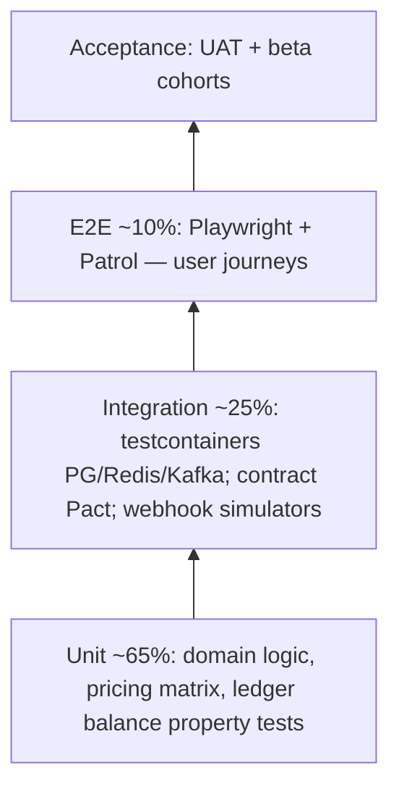

# 20 · Testing Strategy & QA Strategy

**Deliverables:** 47 (Testing) · 48 (QA)

---

## 47 · Testing Strategy

| Layer | Scope | Tools | Gate |
|---|---|---|---|
| **Unit** | pricing engine (fare matrix), escrow state machine, ledger double-entry (property: always balances), policy engine, matching score | Jest/Vitest | ≥ 80% domain libs coverage; mutation testing (Stryker) on money libs quarterly |
| **Integration** | services with real PG/Redis/Kafka via testcontainers; PSP sandbox simulators (happy/fail/timeout); GDS sandbox | Jest + Testcontainers | all FR-PAY/BKG paths green |
| **Contract** | API consumers (mobile/web) ↔ providers; PSP/GDS schema diffs | Pact + schema registry | breaking change = block |
| **E2E web** | customer web booking, vendor console flows, corporate approvals, admin queues | Playwright (chromium+webkit, mobile viewport) | P0 journeys nightly |
| **E2E mobile** | booking→trip→receipt; SOS drill; offline-mode | Patrol on device farm (Firebase) | release gate |
| **Performance** | 5k GPS events/s ingest; 300 RPS booking; socket fanout 25k | k6 + Grafana | p95 within NFR-001..004 |
| **Chaos** | PSP failover, map-provider failover, AZ loss, Redis flush | Gremlin-style drills (staging) | failover within RTO |
| **Security** | SAST, DAST (ZAP), dependency & secrets scan, annual pen test | CI + vendor | no High in release |
| **Localization** | 5 languages pseudo-loc + screenshots | Fastlane snapshot | no truncation/overlap |
| **Accessibility** | axe-core web; mobile semantic labels | CI + manual audit | WCAG 2.1 AA |

**Money-critical test matrices (must-pass):** fare components × extras × promo × surge cap; escrow lifecycle × refund/dispute/partial/milestone; chargeback reversal; T+1 & same-day payout batching; reconciliation 3-way match (ledger ↔ PSP ↔ payout).

## 48 · QA Strategy

**Environments:** `local` (docker-compose) → `ci` (ephemeral) → `staging` (prod-like + PSP/GDS sandboxes + seed data) → `prod` (canary + feature flags). Preview env per PR.

**Test data management:** synthetic PII generator (Nigerian phone/NIN formats, CAC numbers); anonymized production snapshot for perf (monthly refresh, PII scrubbed).

**Release quality gates**

1. All CI gates green; coverage delta ≥ 0
2. P0/P1 defects = 0 open; P2 ≤ 5 with owner/date
3. E2E P0 journeys green × 3 consecutive nightly runs
4. Money reconciliation diff = 0 on staging over 24h soak
5. Performance budget check (p95 ≤ NFR targets @ 2× expected peak)
6. Security scan clean (no High/Critical)
7. DR/smoke runbook executed once per release train
8. Feature-flagged dark launch plan documented

**Defect management:** Jira workflows `New → Triaged (Sev P0-P3) → In progress → Verified → Closed`; SLA: P0 fix < 24h, P1 < 72h; weekly triage with product; blameless post-mortems for P0.

**Traceability matrix (live doc → CI report):** every FR-xxx (SRS) maps to ≥ 1 automated test suite ID; release checklist auto-reports untraced FRs.

**UAT & beta:** scripted UAT per persona (docs/04 §1.2) with Lagos vendor cohort (50 vendors alpha); TestFlight/Play beta rings; feedback tagged to FRs.

**Non-functional QA:** battery/data-usage lab tests on low-end Android (2GB RAM class); crash analytics triage daily during rollout windows; a11y audits per portal each quarter.
