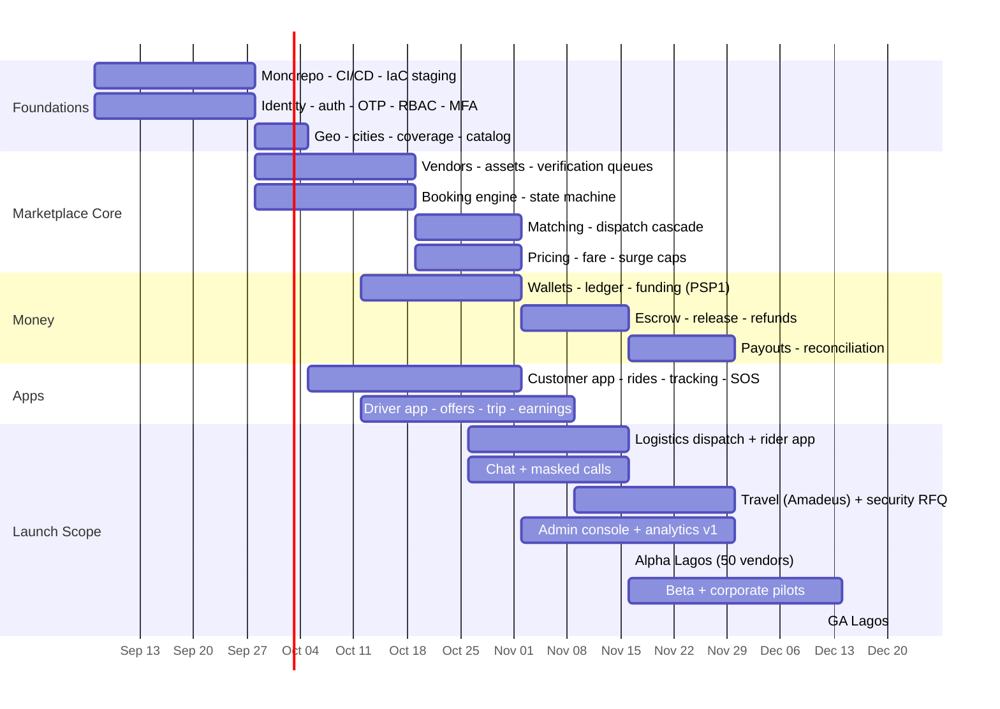

# 21 · Roadmaps — MVP · Product · Scaling

**Deliverables:** 49 (MVP Roadmap) · 50 (Product Roadmap) · 51 (Scaling Strategy)

---

## 49 · MVP Roadmap (16 weeks to GA Lagos)

**MVP scope discipline:** rides (all classes) + dispatch logistics + travel + security RFQ + wallet/escrow + safety + admin. Deferred from MVP: aviation consumer UI (schema/flags only), marine, loyalty redemption (accrue only), video consults, subscriptions (launch Free tier only).

**Gates:** R0 internal E2E (wk 6) → Alpha (wk 10) → Beta (wk 14) → GA (wk 16). Each gate criteria in `04-prd.md` §4.

## 50 · Product Roadmap (36 months)

| Quarter | Theme | Key ships | Exit metric |
|---|---|---|---|
| 2026 Q4 (M1-3) | **Trust core** | MVP GA Lagos; rides+dispatch+travel+security RFQ; escrow; SOS | 25k installs, 1.2k vendors, match p95 <90s |
| 2027 Q1 (M4-6) | **City engine** | Cities 2-10 rollout; loyalty redemption; vendor subscriptions paid tiers; corporate portal GA | 5 cities live, 120k installs, ₦120M GMV/mo |
| 2027 Q2 (M7-9) | **Enterprise & comms** | Video consults; recurring corporate; invoice/WHT pack; fraud ML v2; Pidgin/Hausa full parity | 40 corporates, AI containment 55% |
| 2027 Q3 (M10-12) | **Aviation launch** | Charter/air ambulance consumer flows; milestone escrow; Amadeus+Sabre redundancy | Aviation GMV $250k/mo |
| 2027 Q4 (M13-15) | **Multi-country prep** | Multi-currency settlement; GHS live (Accra); Kenya market entry; passkey auth | Ghana 20k installs |
| 2028 Q1-2 (M16-21) | **Pan-African** | Kenya (Nairobi), SA (Johannesburg/Cape Town); marine (Lagos waterways pilot); diaspora pay-for-family beta (UK) | 4 countries, $6M GMV/mo |
| 2028 Q3-4 (M22-27) | **Corridors** | UAE/UK/US payer corridors; corporate cross-border; API products v1 (fraud/routing); loyalty VIP events | 30% diaspora-paid GMV in travel/remittance-adjacent |
| 2029 (M28-36) | **Platform scale** | Marine GA; B2B logistics API; marketplace ads auction; open finance integrations; Series B | $150M annual GMV run-rate |

## 51 · Scaling Strategy

**Technical scaling ladder** (triggers → actions):

| # | Trigger | Action |
|---|---|---|
| 1 | > 100 bookings/min city | Redis-backed dispatch queues per city shard; matching reads from replica |
| 2 | DB CPU > 60% sustained | Physically split `money` schema → dedicated cluster; PgBouncer transaction pooling everywhere |
| 3 | > 10M GPS events/day | Timescale compression + continuous aggregates; raw tiering to S3 |
| 4 | Socket fanout > 25k/pod | Dedicated realtime cluster + Redis cluster adapter; presence sharding |
| 5 | Multi-country latency | Regional read replicas + local CDN edges; write-forwarding for money via single writer region (consistency > latency for ledger) |
| 6 | Kafka lag on analytics | ClickHouse/Timescale marts replacing PG rollups; consumer autoscale on lag |
| 7 | Model latency/cost | Distill LLM assistant; feature store online store in-region; batch scoring where possible |

**Operational scaling:** city-pod org model (City Manager + 2 ops) until 300 bookings/mo-city then +1; central vendor-verification CoE with 48h SLA automation; support deflection targets (AI 70%) keep headcount sublinear.

**Economic scaling:** supply density before demand spend (heatmap-driven incentives); CAC payback < 6 weeks target per city; vendor subscription revenue flips cities contribution-positive by month 4-6.
