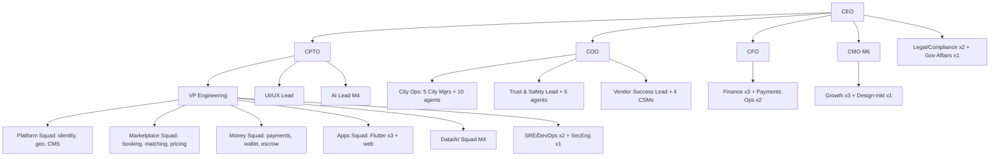

# 22 · Team Hiring Plan · Development Timeline · Development Cost

**Deliverables:** 52 (Hiring) · 53 (Timeline) · 54 (Dev Cost)

---

## 52 · Team Hiring Plan

### Phase org chart (Month 18: 62 people)

### Hiring schedule (role · count · start month · location)

| Team | Roles | M0-3 | M4-9 | M10-18 | Location |
|---|---|---|---|---|---|
| Exec | CEO, CPTO, COO, CFO | 4 | +CMO (M6) | — | Lagos (+remote OK) |
| Backend | Senior NestJS ×3, Mid ×4, QA-eng ×1 | 3 | +3 | +2 | Lagos/hybrid |
| Flutter | Senior ×2, Mid ×3 | 2 | +2 | +1 | Lagos/hybrid |
| Web (Next.js) | Senior ×1, Mid ×2 | 1 | +2 | — | hybrid |
| AI/Data | Lead ×1, DS ×2, MLE ×1 | — | +3 | +1 | remote OK |
| SRE/Security | SRE ×2, Security Eng ×1 | 1 | +2 | +1 | hybrid |
| Design | UI/UX Lead ×1, Product Des ×1, Reseacher ×1 (M9) | 1 | +1 | +1 | hybrid |
| Product | PM ×2, BA ×1 | 2 | +1 | — | Lagos |
| City Ops | City Manager ×5, Ops agents ×10 | 2+2 | +3+4 | +0+4 | per-city |
| Trust & Safety | Lead ×1, agents ×5 | 1+1 | +2 | +2 | Lagos 24/7 shifts from M9 |
| Vendor Success | Lead ×1, CSM ×4 | 1 | +2 | +2 | Lagos |
| Finance/Payments | Accountant, PayOps ×2, Analyst | 2 | +2 | +1 | Lagos |
| Support | Team Lead ×1, agents ×12 (AI-augmented) | 2 | +5 | +6 | Lagos + remote |
| Legal | Counsel ×1, Compliance ×1 | 1 | +1 | — | Lagos |
| **Total headcount** | | **31 (incl. founders)** | **+27** | **+16 → 74 cumulative peak, 62 steady** | |

Nigerian-tech competitive packages (market percentiles P60-75): equity 0.05–2.0% for non-founders; engineers ₦8–18M/yr; leads ₦20–30M/yr; execs ₦35–60M/yr + equity.

## 53 · Development Timeline

See gantt in `21-roadmaps.md`. Summary milestones: **Wk 6** R0 internal · **Wk 10** Alpha Lagos · **Wk 14** Beta + 5 corporates · **Wk 16** GA Lagos · **Wk 18-26** cities 2-10 · **M10-12** aviation GA · **M13-15** Ghana · **M16-21** Kenya+SA · **M22+** diaspora corridors.

## 54 · Development Cost Estimate

Assumptions: blended fully-loaded cost/engineer ₦12.5M/yr (≈ $8.3k @ ₦1,500/$); infrastructure seed-scale; mobile+web included.

| Category | M1-6 | M7-12 | M13-18 | 18-mo total |
|---|---|---|---|---|
| Engineering & product salaries | $612k | $834k | $1.02M | **$2.47M** |
| Design & UX | $54k | $84k | $96k | $234k |
| Cloud & APIs (EKS, RDS, Redis, MSK, maps, PSP fees on sandbox, GDS) | $38k | $72k | $110k | $220k |
| Software/services (Atlassian, Sentry, Datadog-lite, SMS/OTP, device farm) | $22k | $38k | $52k | $112k |
| Security & compliance (pen test, audits, legal, licensing) | $46k | $58k | $66k | $170k |
| Office & equipment | $48k | $54k | $60k | $162k |
| Recruitment (agency fees ~12% first-year for ~45 hires) | $58k | $64k | $38k | $160k |
| **Development total** | **$878k** | **$1.20M** | **$1.44M** | **$3.53M** |

(Development ≈ 60% of the $3.5M raise + early revenue; remaining raise covers GTM & ops working capital per `23-costs-financials.md`.)
