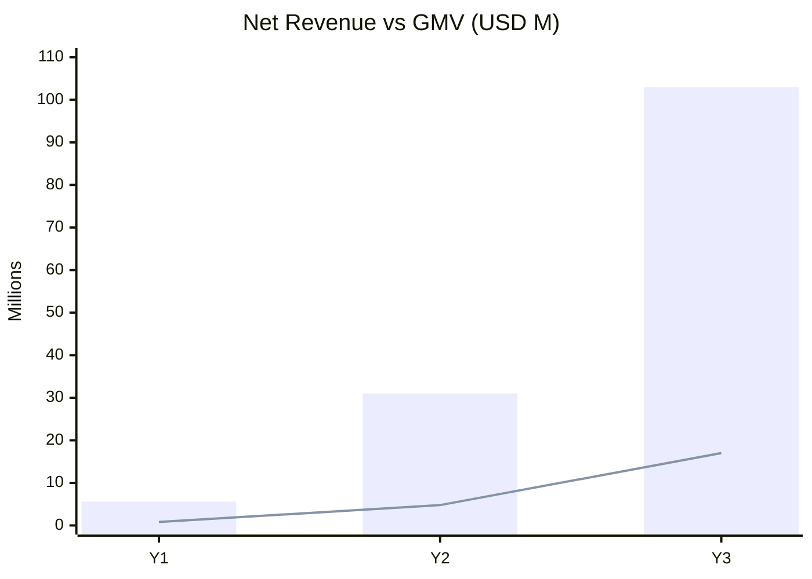

# 23 · Operational Cost & Financial Projections

**Deliverables:** 55 (OpEx) · 56 (Financial Projections) · FX planning base: ₦1,500/$

---

## 55 · Operational Cost Estimate (monthly steady-state)

| Category | M6 | M12 | M18 | Notes |
|---|---|---|---|---|
| Salaries (62 → steady team) | $148k | $186k | $214k | per hiring plan |
| Cloud (EKS, RDS×3, Redis, MSK, OpenSearch, S3, CDN) | $6.5k | $12k | $21k | scales w/ GMV |
| Maps/GPS API (Google, w/ OSM offload) | $4k | $14k | $24k | offload routing to OSRM saves ~35% |
| PSP fees (≈1.5% blended on collected GMV) | $5.8k | $19k | $33k | pass-through cost |
| SMS/OTP/WhatsApp/voice masking | $3.2k | $9k | $14k | OTP via WhatsApp saves 40% |
| GDS/flight API + ticketing floats | $0.8k | $4k | $7k | |
| Marketing & promos (CAC + incentives) | $18k | $55k | $85k | gated by payback <6wk |
| Support & T&S tools | $1.2k | $2.6k | $3.8k | |
| Office, misc, insurance | $9k | $12k | $14k | incl. liability cover |
| **Total OpEx** | **$196k/mo** | **$314k/mo** | **$416k/mo** | |

Unit economics context (M18): net revenue run-rate ≈ $310k/mo vs OpEx $416k/mo → contribution from subscription+corporate revenue closes gap by M26-30 (break-even ~M30 at ~$620k/mo revenue).

## 56 · Financial Projections

### Assumptions

| Driver | Y1 | Y2 | Y3 |
|---|---|---|---|
| Cities | 10 NG | 10 NG + 2 GH | +KE/ZA + corridors |
| Active customers (avg) | 28k | 95k | 260k |
| Bookings/mo (exit) | 180k | 620k | 1.55M |
| AOV blended | ₦7,400 ($4.9) | ₦8,600 ($5.7) | ₦10,200 ($6.8) |
| Blended take rate | 12.5% | 13.0% | 13.5% |
| Subscription+corporate+fees rev | 12% of net | 15% | 18% |

### P&L summary (USD)

| Line | Y1 | Y2 | Y3 |
|---|---|---|---|
| GMV | $5.6M | $31M | $103M |
| Commission revenue | $0.70M | $4.03M | $13.9M |
| Subscriptions + corporate fees + service fees + ads | $0.11M | $0.75M | $3.1M |
| **Net revenue** | **$0.81M** | **$4.78M** | **$17.0M** |
| COGS (PSP, maps, cloud, support tools) | $0.24M | $1.30M | $4.10M |
| **Gross profit (margin)** | $0.57M (70%) | $3.48M (73%) | $12.9M (76%) |
| OpEx (R&D, ops, marketing, G&A) | $2.9M | $4.4M | $8.1M |
| **EBITDA** | **−$2.33M** | **−$0.92M** | **+$4.8M** |
| Cumulative funding need | Seed $3.5M covers to M18; Series A $8-10M at M15-18 funds Y2-Y3 growth | | |

### Revenue mix by vertical (Y2)

| Vertical | GMV share | Net rev share |
|---|---|---|
| Transportation | 52% | 58% |
| Logistics | 27% | 28% |
| Travel | 12% | 8% |
| Security | 6% | 6% |
| Aviation | 3% | 2% (ramping) |

### Key ratios

| Metric | Y1 | Y2 | Y3 |
|---|---|---|---|
| LTV:CAC | 4.8× | 5.3× | 5.8× |
| Contribution margin/booking | 68% | 72% | 75% |
| Fraud loss % GMV | 0.6% | 0.45% | 0.35% |
| Escrow float (avg) | $0.4M | $2.4M | $8.5M |

**Sensitivity:** take-rate −2pts → Y3 revenue −$2.1M (mitigation: subscriptions/corporate); NGN devaluation 20% → USD revenue −$2.9M (mitigation: USD-linked aviation/travel pricing + non-NGN market revenue from Y2); CAC +30% → payback 8.5wk (mitigation: referral/organic loops).
