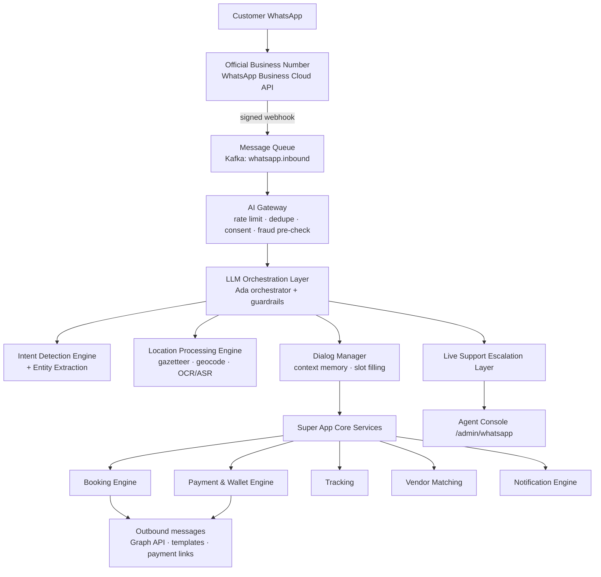
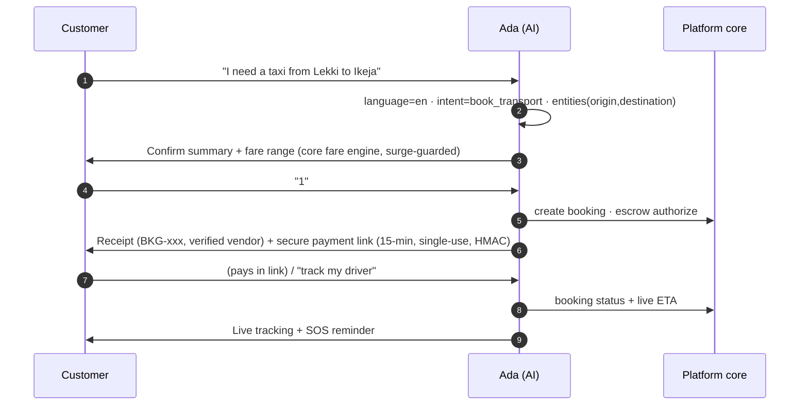

# 26 · WhatsApp Smart AI Customer Service Platform

**Scope:** Full-fidelity conversational client for the entire AMSA ecosystem — service discovery, booking, payments, tracking, support and vendor communication entirely inside WhatsApp, with zero app install.
**Implementation:** `backend/libs/whatsapp/` (working, 30 dedicated tests) · `database/schema.sql §whatsapp` (8 tables + views) · `web/app/admin/whatsapp` (ops panel)
**Status:** Live in sandbox — NLU, dialog, escrow-linked payment links, escalation all verified end-to-end.

---

## 1. Vision & Role

**Ada** — AMSA's WhatsApp AI assistant — is a 24/7 virtual customer-service representative **and** booking agent. She serves the ~90% of Nigerian smartphone users for whom WhatsApp *is* the mobile internet: low data, low storage, no app-store friction. Every service, every workflow, every payment — without opening the app.

**Strategic frame (WhatsApp-first strategy):**

| Objective | Mechanism |
|---|---|
| Zero-install acquisition | CTA "Message us on WhatsApp" on all marketing; QR codes on vehicles, receipts, storefronts |
| Full-journey parity | Discovery → quotes → booking → scheduling → payment → tracking → support → refunds → vendor comms |
| Lowest CAC channel | Conversations replace app-install ads; referral links open chats |
| Trust bootstrap | Escrow messaging + verified-vendor badges in-chat (same trust layer as the app) |
| Language reach | English · Hausa · Yoruba · Igbo · Nigerian Pidgin — detected per message |

## 2. Channel Architecture

**Pipeline stages (implemented in `orchestrator.ts`):** inbound → queue (Kafka in prod) → session/context memory (Redis) → NLU → mid-flow slot handling → action routing (booking/wallet/track/pay/escalate) → reply composition (multilingual) → Graph API send.

## 3. Supported Services (full catalog parity)

| Family | Services reachable via WhatsApp |
|---|---|
| Transportation | Economy/Standard/Premium/VIP taxi, Executive Chauffeur, SUV/Luxury, Airport & Hotel transfers, Intercity, Corporate transport |
| Logistics | Dispatch, Bike delivery, Courier, Parcel, Document, Same-day, Scheduled, Multi-stop |
| Travel | Flight search & booking (one-way/return/multi-city), packages, travel consultation |
| Aviation | Private jets, Helicopters, Charter flights, Air ambulance (quote flow) |
| Security | Executive protection, VIP escort, security drivers, event/residential/corporate security (RFQ + verified badges) |
| Corporate | Bookings on behalf, employee transport, corporate logistics, travel management |
| **Roadside (new)** | Vehicle recovery, towing, emergency mechanical, fuel delivery, tyre replacement, battery assistance |
| **Hotels (new)** | Hotel search & booking, apartments, short-lets |

Roadside & Accommodation ship as new platform verticals: `service_vertical` enum + 10 service categories (`database/migrations/002`), vendor types (already covered by `corporate_service_provider` + new onboarding flows for garages/rescuers and hotels/apartments — the existing hotel vendor type applies).

## 4. Conversation Lifecycle (implemented & tested)

Slot-filling UX rule: **≤ 2 required questions** per intent (pickup/destination pre-fills from message entities or a location pin). Mid-flow short answers ("Ajah") fill the next missing slot instead of re-triggering classification.

## 5. Smart Location Processing

| Input | Pipeline |
|---|---|
| Live GPS / WhatsApp pin | `location` payload → slot fill (pickup→dropoff order) — implemented |
| Map link | URL unwrap → coordinate parse → reverse geocode |
| Typed address | Gazetteer match (30+ Nigerian places, alias-tolerant: "VI", "MMIA", "airport") then Google→OSM geocode fallback |
| Image | OCR (vision model) → labeled extraction ("Pickup: X. Dropoff: Y") → gazetteer/geocode — adapter implemented (`extractLabeledLocations`) |
| Voice note | ASR transcript → same NLU path |

## 6. Voice & Multilingual

- **ASR:** Whisper-class (docs/19 AI-9), 5 languages incl. code-switched Pidgin; transcripts logged to the thread with consent banner.
- **Language detection per message** (marker-based fast path + model fallback); Ada replies in the customer's language — greeting, prompts, receipts, and tracking messages localized (en/pcm/ha/yo/ig).
- **Confidence penalty** for ASR/OCR-derived intents (−0.1) — lower-confidence understanding biases toward clarification or human handoff.

## 7. Booking, Tracking, Wallet & Payments

- **Bookings:** create/modify/cancel/reschedule/confirm — all through the same booking-service API and state machine as the app (docs/07). Escrow messaging mirrored in-chat.
- **Tracking:** "Where is my rider/driver?" → intent `track_order` → live status, ETA, driver, share link.
- **Wallet:** balance (with pending-escrow split), fund (link), transfer, transaction history, rewards — via wallet-service.
- **Payments in-chat:** single-use **signed payment links** (`wpl_*`, HMAC-SHA256, 15-min TTL, PSP-routed Paystack→Flutterwave→Monnify). No card data ever enters WhatsApp (PCI SAQ-A preserved). Link redemption → `payment_intent` → escrow fund → booking `confirmed` → confirmation template.

## 8. Vendor Interaction

Outbound utility templates (Meta-approved) for: booking updates, status changes, delivery updates with OTP release codes, arrival notifications + pickup code, payment/escrow confirmations, milestone sign-off requests. Two-way vendor↔customer chats ride the same threads with **number masking**; vendors never see customer MSISDNs.

## 9. Support Automation & Human Escalation

**AI answers:** FAQs, pricing, availability, refunds policy, payment issues, vendor questions (RAG over policy KB + booking context).

**Escalation triggers (configurable, current thresholds):**

| Trigger | Rule |
|---|---|
| Low confidence | `confidence < 0.55` |
| Explicit | "agent", "human", "customer care" |
| Negative sentiment | sentiment=negative **and** confidence < 0.75 |
| Refund requests | always human-verified |
| Safety/fraud | SOS or fraud signal → ops room immediately |

On escalation: full transcript + context handed to the agent console (`/admin/whatsapp`), AI stands down for the thread (no interleaved messages), SLA target first response < 2 min, resolution note feeds AI training data. Escalation rate target < 20% of conversations by M12.

## 10. AI Capabilities

| Capability | Implementation |
|---|---|
| NLP / intent detection | 17 intents across 8 service families + support intents; rule+gazetteer core with LLM fallback |
| Entity extraction | locations (gazetteer + labeled OCR), datetime (incl. "tomorrow 4pm", "sharp sharp"), class, passengers, item, nights, assist type |
| Conversational AI + context memory | per-phone session: node, draft slots, last booking, language, rolling history |
| Recommendation engine | next-best-service suggestions from history (ride → airport transfer attach) |
| Dynamic service matching | vendor pick reuses the platform matching score (proximity·scorecard·tier·health) |
| Smart routing | skill/language-based agent queues |
| Sentiment analysis | lexicon-based fast path; model-assisted |
| Fraud detection | device/velocity pre-checks at the AI gateway; suspicious flows step-up OTP before payment links |
| LLM orchestration | guardrailed generation (PII redaction, no refund promises, refusal paths), model per-task routing |

## 11. Security (channel-specific)

WhatsApp payloads are E2E-encrypted in transit by WhatsApp; AMSA adds: **webhook signature verification** (X-Hub-Signature-256), **OTP verification** linking wa_phone → platform identity before money actions, **session management** (24h expiry, one live thread per MSISDN), **rate limiting** (per-phone token bucket; template-budget guards), **device verification** + fraud monitoring on link clicks, **audit logs** (every AI decision logged with intent/confidence/entities → `whatsapp.messages`), marketing **opt-in consent** enforced (NDPR + Meta policy). Payment links: HMAC-signed, single-use, short-TTL, idempotent redemption.

## 12. Admin Panel (`/admin/whatsapp` — built)

Live conversation list with intent/language/node, escalation inbox (agent assignment, SLA), AI performance dashboard, template manager (Meta approval states), broadcast campaign manager (audience builder, approval gate, cost tracking), CSAT surveys, training-data review queue (escalated transcripts → labeling → model improvement).

## 13. Analytics (daily rollups → `whatsapp.analytics_daily`)

Total & active conversations · completed bookings · conversion rate · CSAT · avg response time (AI + human) · AI resolution rate · escalation rate · revenue attributed (GMV & net revenue per conversation cohort). Cohort view: WhatsApp-acquired vs app-acquired customers (LTV comparison) — KPI: WhatsApp conversion ≥ 60% of app conversion by M12.

## 14. API Surface (added to `docs/10` catalog)

| Method | Path | Description |
|---|---|---|
| GET | `/webhooks/whatsapp` | Meta subscription verification |
| POST | `/webhooks/whatsapp` | Signed inbound messages → queue → orchestrator |
| POST | `/v1/whatsapp/simulate` | Test harness: play a message, get Ada's reply (used in tests/demo) |
| GET | `/v1/whatsapp/sessions/:phone` | Conversation state + history (ops) |
| GET | `/v1/whatsapp/stats` | Conversation/bookings/escalation counters |
| POST | `/v1/whatsapp/broadcasts` | Campaign create (admin, approved templates only) |
| GET | `/v1/whatsapp/analytics?from=&to=` | Dashboard metrics |

## 15. Test Coverage (30 tests, all green)

Intent classification across all 8 families · language detection (5 languages) · location extraction (typed/pidgin/OCR-labeled/pin) · datetime parsing · full booking conversations (taxi & delivery, slot-filling, confirm/change/cancel) · wallet & signed payment links (tamper + single-use rejection) · voice & image adapters · Pidgin receipts · escalation (confidence/explicit/negative-sentiment) · stats accounting.

## 16. Rollout Plan

| Phase | Window | Scope | Gate |
|---|---|---|---|
| W1 Pilot | GA + 2 wks | Support + FAQs only (deflect tickets) | CSAT ≥ 4.3, containment ≥ 40% |
| W2 Booking | +4 wks | Rides + logistics booking & payment links | Conversion ≥ 25%, payment success ≥ 95% |
| W3 Full parity | +8 wks | Travel, security RFQ, roadside, hotels, tracking | Escalation < 25%, fraud = 0 |
| W4 Proactive | +12 wks | Broadcasts (opt-in), reminders, re-engagement | Opt-out < 1.5% |

Meta prerequisites: business verification, WABA number, template approvals (utility×6 pre-seeded), quality-rating monitoring (tier scaling to 100k msgs/day).
