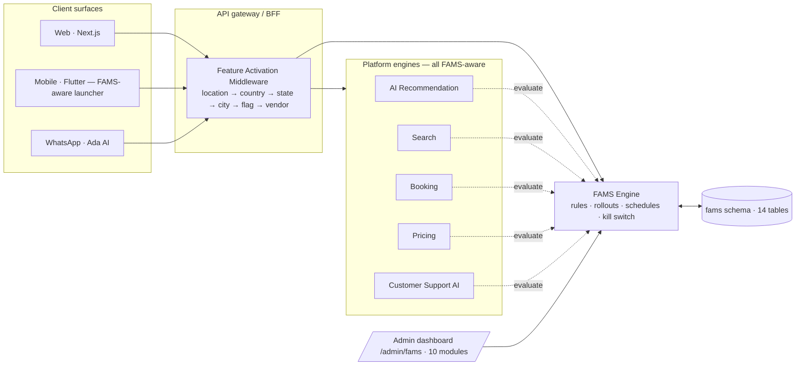
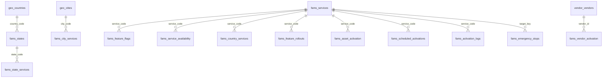

# 28 · FAMS — Feature Activation Management System

**Purpose:** One centralized control plane where administrators **activate, deactivate, hide, schedule, roll out, restrict or expand** any service, location, category, feature, vendor or asset — **without changing source code and without releasing a new application version**. Every module is built from day one; what customers see, search for, get recommended, and can book is decided by FAMS rules per phase / country / state / city / geofence / user group / vendor / asset / time window.

**Status:** Implemented v2 (engine + staged middleware + API + WhatsApp & AI obedience + 10-module admin dashboard + 14-table DB schema + mobile availability-aware launcher). Tests: 29 engine + 20 integration green (117 across the whole suite).
**Code:** `backend/libs/fams/src/` · `backend/apps/api/main.ts` (FAMS section) · `web/app/admin/fams/` · `mobile/lib/core/fams/` · `database/migrations/004-fams.sql` + `005-fams-expansion.sql`

> Canonical customer-facing message when anything is OFF — exact string, everywhere (app, API 403, WhatsApp AI, support AI):
>
> **"Service is currently unavailable in your location."**

---

## 1. Why FAMS exists

Launching a 10-vertical super app country-by-country means availability is **not a code question** — it is an operations question:

- Benin City has no heliport clearance → aviation must be OFF there, ON in Lagos.
- Kenya launch is 3 months out → transportation/logistics OFF for `+254` users, today.
- A vendor's insurance lapses → suspend (or disable) that vendor in seconds, not sprints.
- A VIP fleet goes for training → put the `ride.vip` category into maintenance until it returns.
- A promo must run 01 Nov 2026 → 31 Jan 2027 → schedule it, walk away.
- Regulator grounds charter flights → one kill switch, no deploy.

FAMS turns all of these into **data**, evaluated on every request through one middleware engine.

## 2. Core concepts

| Concept | Values / meaning |
|---|---|
| **Activation value** | `on` · `off` · `hidden` (not marketed, invisible to search/AI) · `maintenance` (temporary, surfaced as maintenance) · `beta` (available to opted-in groups) |
| **Scope levels (precedence)** | asset **70** > vendor **60** > category **50** > city **40** > state **30** > country **20** > global **10** |
| **Group bonus** | +15 weight for user-group-scoped rules (a beta-only rule beats a plain rule at the same level) |
| **Tie-break** | most recent decision wins (monotonic `version` counter — never wall-clock ties) |
| **Kill switch** | emergency stop overrides *every* rule including city-ON, effective on the next request, no deploy |
| **Availability** | `value ∈ {on, beta}` → available; everything else → blocked with the canonical message |

**Override semantics (deliberate, test-pinned):**

- Not-yet-started rule → **skipped** (a future "ON" doesn't leak today).
- Expired rule that said ON → **effective OFF** (never silently fall back to parent-ON).
- Geofenced rule with the user outside the fence → **OFF** (never default-ON).
- User-group / rollout-% excluded → `available: false` with a cohort reason (soft exclusion).
- City **ON** beats state **OFF** beats country **OFF** — deepest scope wins.

## 3. What can be controlled (spec v2 catalog)

**24 global switches:** Transportation · Taxi Services · Dispatch Services · Logistics · Delivery · Travel · Flights · Hotels · Accommodation · Roadside Assistance · Security Marketplace · Aviation · Marine Services · Corporate Services · Wallet · Escrow · Loyalty Program · Subscription Plans · Promotions · WhatsApp AI Assistant · AI Features · Video Calls · Voice Calls · Chat System.

**Country / State / City** — seeded examples: KE transportation+logistics OFF; GH security+travel OFF; Edo state aviation+travel OFF; **Benin City** taxi ON / dispatch ON / hotels ON / **security OFF**; **Asaba** taxi ON / dispatch ON / **aviation OFF**.

**Service categories (independent switches):**

| Family | Categories |
|---|---|
| Transportation | Economy Taxi · Standard Taxi · Premium Taxi · VIP Taxi (maintenance) · Executive Chauffeur |
| Dispatch | Bike Dispatch · Courier · Parcel Delivery · Document Delivery |
| Travel | Domestic Flights · International Flights · Hotel Booking |
| Security | Executive Protection Coordination · VIP Escort Coordination · Event Security · Corporate Security · Security Driver Services |
| Aviation | Helicopter Booking · Private Jet Booking · Charter Flights · Air Ambulance |
| Marine | Boat Charter · Yacht Charter · Water Taxi (Phase 5) |

**Vendors** — 5-state lifecycle: `active` · `suspended` · `pending_review` · `maintenance` · `disabled` (maps to on/off/hidden/maintenance/off engine values).

**Assets** — 8 spec classes, per class or per unit: Cars · Motorcycles · Dispatch Bikes · Helicopters · Private Jets · Charter Aircraft · Boats · Yachts.

**Feature flags** — WhatsApp AI Assistant · AI Dynamic Pricing · Wallet · Escrow · Video Calling · Voice/Chat · **Live Tracking** · **Corporate Portal** (+ next-gen assistant ON only for beta+VIP).

**User groups (7):** Customers · Drivers · Riders · Vendors · Corporate Clients · Beta Testers · VIP Customers.

**Time-based activation:** e.g. activate 01 January 2027 00:00, deactivate 31 January 2027 23:59 (`scheduled_activations` + `POST /v1/fams/tick`; promo.ride20 auto-expires 31 Jan 2027).

**Geofenced activation:** Airport Transfer bookable **only inside** the MMIA fence (6.5774, 3.3212, 15 km); city rules can carry their own fence.

## 4. Phased launch system (spec-exact)

| Phase | Enables | Seeded state @ phase 4 |
|---|---|---|
| **1** | Taxi · Dispatch · Logistics · Wallet · Escrow · WhatsApp AI *(disabled: Aviation, Marine, Security, Hotels)* | live |
| **2** | Travel · Flights · Hotels · Accommodation · Corporate Services · Roadside Assistance | live |
| **3** | Security Marketplace · Executive Protection · VIP Escort · Security Driver Services | live |
| **4** | Aviation · Helicopter · Private Jet · Charter · Air Ambulance | **active** |
| **5** | Marine · Boat Charter · Yacht Charter · Water Taxi | planned |

Flipping a phase (or any single switch) is a runtime rule change — the whole 25-module catalog is seeded and evaluated on every request.

## 5. Middleware engine — spec workflow, implemented

```
User Request
   ↓
Feature Activation Middleware
   ↓
Location Validation ── resolve country/state/city (+ geo if present)
   ↓
Country Validation
   ↓
State Validation
   ↓
City Validation
   ↓
Feature Flag Validation (module + feature rules)
   ↓
Vendor Validation
   ↓
Booking Engine  ← allowed only if every gate passes
```

`FamsEngine.evaluatePipeline()` returns this exact trace as inspectable stages; the middleware attaches it to `req.fams` and to 403 responses. Precedence is preserved (a city-ON rule legitimately overrides a state-OFF rule) while the trace shows every contribution, so ops can see *why* a request was allowed or blocked.

```json
// 403 from POST /v1/bookings/estimate {"country":"KE"}
{ "code": "SERVICE_UNAVAILABLE",
  "message": "Service is currently unavailable in your location.",
  "details": { "service": "transportation", "decision": {…},
               "pipeline": [ {"stage":"location"}, {"stage":"country","value":"off"},
                             {"stage":"state"}, {"stage":"city"},
                             {"stage":"feature-flag"}, {"stage":"vendor"},
                             {"stage":"booking-engine","checked":false} ] } }
```

## 6. Architecture



Every AI surface (recommendation, search, booking, pricing, support, WhatsApp) evaluates FAMS before answering — no helicopter recommendations where aviation is off, no hotel options where hotels are off.

## 7. Database design (migrations 004 + 005 → schema `fams`)

**14 tables.** Spec-named: `feature_flags`, `service_availability`, `country_services`, `state_services`, `city_services`, `vendor_activation` (5 states), `asset_activation` (8 classes), `feature_rollouts`, `scheduled_activations`, `activation_logs`. Supporting: `services` (registry), `states`, `emergency_stops`, `audit_log`. Plus view `v_activation_analytics` (10th dashboard module). `geo.countries` / `geo.cities` reused from 001.



Key columns: `value ∈ {on,off,hidden,maintenance,beta}` · `user_groups TEXT[]` · `rollout_pct` · `starts_at/ends_at` · `geofence JSONB` · `version BIGINT` (monotonic tie-break) · `activation_logs` records actor/role/action/scope/selector/before/after/reason/IP for every change (compliance trail).

## 8. API specification (live on the demo service)

| Method & path | Purpose |
|---|---|
| `GET /v1/feature-flags` | evaluate the spec flags for a context + list feature rules |
| `POST /v1/feature-flags` · `PUT/DELETE /v1/feature-flags/:id` | create / update / remove (level/selector/value/userGroups/rolloutPct/window/geofence) |
| `GET /v1/service-availability` | per-context matrix: 8 verticals + 5 features |
| `POST /v1/service-availability` · `PUT /v1/service-availability/:id` | create / update location gates |
| `GET/POST /v1/fams/vendors` | vendor lifecycle (active/suspended/pending_review/maintenance/disabled) |
| `GET/POST /v1/fams/assets` | asset activation (8 classes, per class or unit) |
| `GET /v1/fams/locations` | Country/State/City management rules + city catalog |
| `GET /v1/fams/rules` | full catalog: rules, 24 modules, categories, phases, cities |
| `GET/POST /v1/fams/emergency` | kill switch list / arm / clear (`target: "vertical:aviation"`) |
| `GET/POST /v1/fams/schedules` · `POST /v1/fams/tick` | time-based activations + scheduler run |
| `GET /v1/fams/analytics` | Activation Analytics: totals, middleware counters, rules-by-level/value, per-city coverage |
| `GET /v1/fams/health` | rules / emergencies / schedules counters |

Writes require an admin session (RBAC in production); every change is audit-logged. `POST /v1/bookings*` passes through the Feature Activation Middleware (403 + canonical message + pipeline trace).

## 9. AI obedience — every AI surface respects activation

`backend/libs/whatsapp/src/orchestrator.ts` and the API middleware implement the spec's integration requirements:

- **Master switch:** if `module:whatsapp_ai` is killed, the assistant replies with only the canonical message.
- **Intent-time gate:** booking intents map to verticals+categories (taxi/chauffeur→transportation, delivery/dispatch/courier/parcel→logistics+dispatch categories, flights→travel, security→security+category, roadside, accommodation, aviation, corporate) and are gated *before* a draft is created — city/state from the gazetteer, country from the phone (`+254`→KE, `+233`→GH, else NG).
- **Confirmation-time re-gate:** the final "yes" re-checks with the destination city.
- **Recommendations & search filtered:** greetings and "what's available in …" list **only** FAMS-enabled verticals for that city — never a helicopter where aviation is OFF, never hotel options where hotels are OFF (both test-pinned).
- **Blocked reply:** explains the state (off / maintenance / not offered), carries the canonical message verbatim, offers up to 5 live alternatives.
- **Pricing/booking engines:** the middleware stops the chain *before* pricing, dispatch or escrow; the mobile launcher renders only available tiles (fails closed on network errors).

## 10. Admin dashboard — `/admin/fams` (10 modules + wireframes)

1. **Service Control Center** — the 24 global switches in one grid.
2. **Country Management** — per-country rows (NG all on · GH travel/security off · KE transport/logistics off).
3. **State Management** — NG-ED aviation + travel off.
4. **City Management** — Benin City security off · Asaba aviation off · geofenced airport transfer.
5. **Vendor Management** — 5-state lifecycle table.
6. **Asset Management** — 8 spec classes, class- or unit-level.
7. **Feature Flags** — 10 flag rows incl. live tracking + corporate portal.
8. **Rollout Management** — phases 1–5 + audience rollouts (7 user groups).
9. **Emergency Shutdown** — 11 armed kill domains, one POST away.
10. **Activation Analytics** — per-city coverage, rule distribution by scope, blocked-request counters.

```
┌─ FAMS — Feature Activation Management System ────────────────────────┐
│ [Service control] [Country] [State] [City] [Vendor] [Asset]          │
│ [Feature flags] [Rollout] [Emergency] [Analytics]                    │
├──────────────────────────────────────────────────────────────────────┤
│ Phase 4/5 · Switches 24/24 · Rules 41 · Stops 0 · Blocked 128        │
│ 🚗 Transportation    [ on ]      ✈️ Travel           [ on ]           │
│ 🛵 Dispatch          [ on ]      🏨 Hotels           [ on ]           │
│ 🚁 Aviation          [ on ]      ⚓ Marine           [ off · phase 5 ]│
│ 💬 Chat / 📞 Voice / 📹 Video    [ on ]      🤖 WhatsApp AI [ on ]    │
│ …                                                                   │
│ 🛑 EMERGENCY: [Transportation][Dispatch][Logistics][Travel]          │
│               [Security][Aviation][Marine][Payments][Wallet]         │
│               [Escrow][WhatsApp AI]            → canonical message   │
└──────────────────────────────────────────────────────────────────────┘
```

## 11. Verification

- `backend/tests/fams.test.ts` — 29 engine tests (precedence, expiry, geofence, cohorts, kill switch, scheduler, **pipeline trace, spec phase presets P1/P5, category families, 5 vendor states, 8 asset classes, 7 user groups**).
- `backend/tests/fams-api.test.ts` — 20 integration tests (spec endpoints CRUD, middleware 403 + canonical message + trace, kill switch round-trip, schedule→tick, vendor/asset/location/analytics endpoints, **Ada obedience: no helicopter in Benin City, no hotels where hotels off, WhatsApp AI master switch**).
- Live receipts (demo API :4300): `{"country":"KE"}` estimate → 403 canonical; Benin City availability → transportation/hotels ON, aviation/travel/security OFF; `I need a helicopter in Benin City` → canonical + alternatives, never a charter.

## 12. Runbook (production)

| Scenario | Action | Effect |
|---|---|---|
| Regulator grounds helicopters | `POST /v1/fams/emergency {"target":"vertical:aviation","on":true}` | every app/AI stops offering aviation on the next request |
| Vendor fraud case | `POST /v1/fams/vendors {"vendorId":"vnd_x","state":"disabled"}` | vendor hidden from matching instantly |
| City launch | `PUT /v1/service-availability/:id {"value":"on"}` for `NG-BNI` | tiles + AI options appear, no release |
| Scheduled go-live | `POST /v1/fams/schedules {"runAt":"2027-01-01T00:00:00Z", …}` + cron `tick()` | activates automatically |
| Seasonal promo end | rule `endsAt: 2027-01-31T23:59:59Z` | expires to OFF by itself |
| Incident review | kill `module:whatsapp_ai` | assistant answers with the canonical message only |

Every action above is logged to `fams.activation_logs` with actor, before/after and reason.
